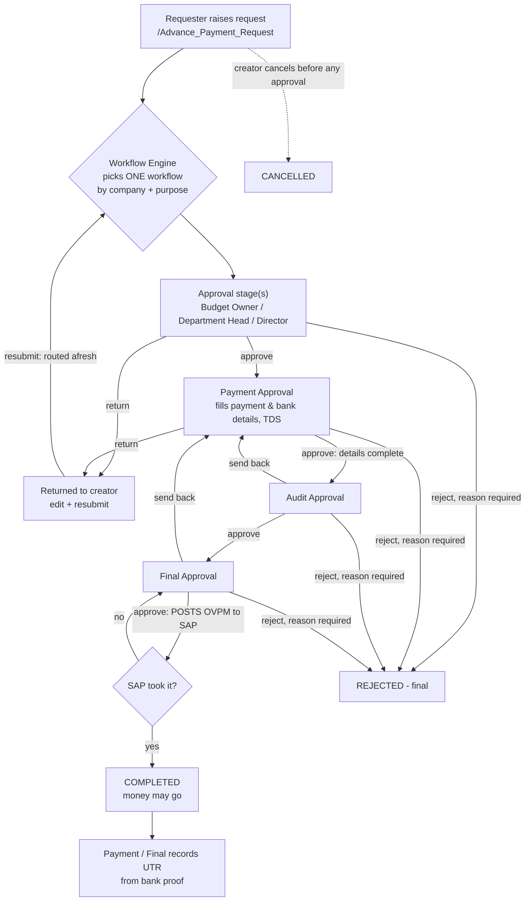

# Payments module (`advance_payment`) — how it works, end to end

> Scope: the **Payments** pages (`/Advance_Payment_Request`, `/Advance_Payment_Approval`,
> `/Advance_Payment_Dispatch`) and the Django app `advance_payment`. This is the module
> that **pays money out** (vendors, employees, customer refunds) through an approval
> route and posts an **outgoing payment (OVPM)** to SAP.
>
> It is **not** the older `payments` app (cash/cheque receipts and bank deposits, the
> mobile app, `/Payments_Dashboard`). That one is covered in `PAYMENTS_DEPOSITS_FLOW_EXPLAINED.md`
> and `PAYMENTS_RELEASE_RUNBOOK.md`.
>
> State as of 2026-10-06 (branch `Mukesh2`).

---

## 1. The whole thing in one picture



Plain words:

1. A requester raises a request: who is paid, against what (bill / PO / advance / ledger), how
   much, the **Department** (SAP budget head) and the **Payment Purpose**.
2. OMS picks **one** workflow for it, by company and Payment Purpose (§4).
3. It climbs the workflow's **approval stages** (0 or more, any names), then the three fixed
   stages **Payment → Audit → Final**.
4. **Payment** fills in how it is paid. **Audit** checks it. **Final** approving posts the
   outgoing payment to SAP. Only when SAP accepts it is the request **COMPLETED**.
5. After paying, the Payment or Final approver records each transfer's **UTR**, read from
   the bank's proof.

**SAP is written once, at the very end.** Nothing reaches SAP before Final approves, so a
return, a send-back or a rejection never has anything in SAP to undo.

---

## 2. Who uses it — roles and permissions

| Permission key | What it opens | Seeded in role |
|---|---|---|
| `Advance_Payment` | The Payments page: raise requests, see your own, all the SAP pickers | `advance_payment_user`, `advance_payment_approver` |
| `Advance_Payment_Approval` | The **Payments Approval** desk | `advance_payment_approver` |
| `Advance_Payment_Dispatch` | **Send Bills & POs** to users | — (grant per user or role) |
| admin role | **Add Employee** (employee master), and reading any request | — |

Roles are created by migration `0008_seed_advance_payment_roles`. They are named
`advance_payment_*` on purpose: `payment_approver` already belongs to the receipts/deposits
ladder.

**A key only opens a page. It never lets you act on a request.** Acting needs, in addition,
being the user of the stage the request waits at **today**. Stand-ins (replacements) are
applied. The server checks this on every action; the buttons on screen just follow the
server's `can` answer.

**Who sees the payee's bank account:** only today's users of the route's Payment, Audit and
Final stages, and admins. The requester and the approval stages before Payment do not see
it. They decide *whether* to pay, not *where* the money goes.

---

## 3. Raising a request

### 3.1 The request types (`CASES` in `services/requests.py`)

| Request type | Payment Against | Pays through | Extra the form asks |
|---|---|---|---|
| Vendor | Against PO | open POs (`DocumentKind.PO`) | Expected Bill Date |
| Vendor | Against Bill | open A/P invoices (`BILL`) | — |
| Employee | Advance | typed amount | repayment: One Time / EMI / Custom |
| Employee | Other | typed amount | — |
| Employee Imprest | Advance | typed amount | Expected Bill Date |
| Employee Imprest | Against Bill | open A/P invoices | — |
| Employee Imprest | Other | typed amount | Expected Bill Date |
| Customer (refund) | Against Ledger | the customer's open ledger items (credits less debits) | — |
| Customer (refund) | On Account | typed amount, applied to nothing | — |

Every request also carries:

- **Company**: OIL, BEVERAGES or MART.
- **Department**: SAP's budget head (OPRC dimension 3), read live from SAP.
- **Payment Purpose**: what the money is for (§3.2). It decides the route.
- **Department Head**: only when the purpose (or an Employee / Imprest request) is approved
  "by department", outside Mart (§5).
- Payment date, remarks, owner (information only), and supporting files (≤ 10 MB each).

### 3.2 Payment Purposes (`purposes.py`)

| Group | Purposes |
|---|---|
| Goods | Oil Purchase (imported or domestic), Raw Material (other than oil, incl. ghee), Packaging Material, Finished Goods / Trading, Semi-Finished, Fixed Assets – Plant & Machinery, Fixed Assets – Civil, Fixed Assets – Others, FA Consumables / Spares, Consumables & Stores, Laboratory / QC |
| Services | Freight Inward, Freight Outward, Freight & Clearing – Import, Job Work / Refining, Casual Labour, Advertising, Commission, Rent, Electricity/Water/Utilities, Legal & Professional, Repairs, Fuel & Vehicle, Travel, Security & Housekeeping, IT/Software, Other Expense |
| People | Salary & Wages, Employee Advance, Employee Imprest, Employee Expense Claim |
| Statutory | TDS / TCS, GST, EPF / ESIC, Other Statutory / Licence |
| Finance | Bank Charges, Interest, Loan / EMI Repayment, Intercompany Transfer, Customer Refund, Land / Property / Capital |

A purpose's **code never changes** once it exists: requests store it and workflow queries
match on it. To retire a purpose, move it to `RETIRED`; `FIXED_ASSETS` was retired on
2026-10-05 when it was split into three.

### 3.3 What the server re-checks on submit

The form (`rules.ts`) validates first, but the server is the authority (`requests.clean`):

- the type / Payment Against pair is a valid case;
- every document line fits within what SAP still has open, **less what other OMS requests
  already hold** (§7). This is checked again inside the save, under a per-document lock, so
  two requests can't both take the last rupee;
- the request amount equals its lines' total (or a typed amount above zero);
- the Department is a real budget head, and the purpose a real purpose;
- when one is needed, the Department Head is an HOD in the employee master **with an OMS
  login** to approve with;
- the dates the case needs are present.

An employee with no advance account in SAP yet can still be requested
(`partner_not_in_sap`). The **Payment stage cannot approve** until the account exists in SAP;
on approval, OMS finds and links it automatically.

### 3.4 Request number

`AP-<year>-NNNN`, per calendar year, given at submission.

### 3.5 Raising from a bill / PO sent to you

A user with `Advance_Payment_Dispatch` picks open SAP bills or POs on **Send Bills & POs** and
sends them to an Advance Payment User or Approver. The recipient sees them under
**Assigned to Me**. Opening one starts the form already filled, re-read live from SAP.
Raising the request marks the assignment `RAISED`. The recipient may instead dismiss it, and
the sender may withdraw it while it is still `OPEN`.

---

## 4. The workflow — how the route is chosen

### 4.1 Mechanism

- The module is registered in the Workflow Engine as **`ADVANCE_PAYMENT`** (Workflows page).
- Each workflow has a **query** over `advance_payment_request`. The engine runs them and
  must find **exactly one** matching workflow. No match, or two matches, refuses the
  submission.
- The chosen workflow and the query that chose it are stored on the request's flow row.
  Later configuration changes don't rewrite that history.
- Changing a stage's user in the Workflows page moves **pending** requests with it, because
  "who acts now" is always resolved live.

### 4.2 The rule every workflow must follow

```
[ any number of approval stages, named freely ]  →  Payment Approval  →  Audit Approval  →  Final Approval
```

The last three must be named **exactly** like that (case and spacing ignored), once each, at
the end and in that order. Otherwise submitting is refused (`flow.roles`).

### 4.3 The hierarchy (agreed 2026-10-05, `hierarchy.py`)

Each request goes to exactly one workflow:

| Request | Goes to |
|---|---|
| any **Mart** request | Prabhjot, whatever its purpose |
| **Employee / Employee Imprest** request type (Oil, Bev) | Department Head (picked) → Director |
| anything else (Oil, Bev) | the workflow of its **Payment Purpose** |

…and every workflow then ends **Payment (taran) → Audit (parmeet) → Final (kamal1)**.

The full list: 46 workflows, generated from `hierarchy.routes()`. Usernames are as on the test
server.

| Code | Name | Company scope | Approval stages before Payment → Audit → Final |
|---|---|---|---|
| `AP_MART` | Mart | MART | Budget Owner Approval (prabhjot) |
| `AP_STAFF_ADVANCE` | Staff Advance / Imprest | Oil, Bev | Department Head Approval (*picked*) → Director Approval (Gurpreet Vg) |
| `AP_OIL_PURCHASE` | Oil Purchase – Imported or Domestic | Oil, Bev | Budget Owner Approval (himanshu) → Director Approval (Gurpreet Vg) |
| `AP_RAW_MATERIAL` | Raw Material – Other than Oil (incl. Ghee) | Oil, Bev | Budget Owner Approval (bhupinder) |
| `AP_PACKING_MATERIAL` | Packaging Material Purchase | Oil, Bev | Budget Owner Approval (bhupinder) |
| `AP_FINISHED_GOODS` | Finished Goods / Trading Purchase | Oil, Bev | Department Head Approval (*picked*) |
| `AP_SEMI_FINISHED` | Semi-Finished Goods | Oil, Bev | Budget Owner Approval (bhupinder) |
| `AP_FA_PM` | Fixed Assets – Plant & Machinery | Oil, Bev | Budget Owner Approval (bhupinder) → Director Approval (Gurpreet Vg) |
| `AP_FA_CIVIL` | Fixed Assets – Civil | Oil, Bev | Budget Owner Approval (bhupinder) → Director Approval (Gurpreet Vg) |
| `AP_FA_OTHERS` | Fixed Assets – Others | Oil, Bev | Department Head Approval (*picked*) → Director Approval (Gurpreet Vg) |
| `AP_FA_CONSUMABLES` | Fixed Asset Consumables / Spares | Oil, Bev | Budget Owner Approval (bhupinder) → Director Approval (Gurpreet Vg) |
| `AP_CONSUMABLES` | Consumables & Stores | Oil, Bev | Department Head Approval (*picked*) |
| `AP_LAB` | Laboratory / QC Materials | Oil, Bev | Department Head Approval (*picked*) |
| `AP_FREIGHT_IN` | Freight – Inward | Oil, Bev | Department Head Approval (*picked*) |
| `AP_FREIGHT_OUT` | Freight – Outward / Transport | Oil, Bev | Department Head Approval (*picked*) |
| `AP_FREIGHT_IMPORT` | Freight & Clearing – Import | Oil, Bev | Budget Owner Approval (himanshu) → Director Approval (Gurpreet Vg) |
| `AP_JOB_WORK` | Job Work / Refining | Oil, Bev | Department Head Approval (*picked*) |
| `AP_LABOUR` | Casual Labour / Loading | Oil, Bev | Department Head Approval (*picked*) |
| `AP_ADVERTISING` | Advertising & Marketing | Oil, Bev | Department Head Approval (*picked*) |
| `AP_COMMISSION` | Commission & Brokerage | Oil, Bev | Department Head Approval (*picked*) |
| `AP_RENT` | Rent | Oil, Bev | Department Head Approval (*picked*) |
| `AP_UTILITIES` | Electricity, Water & Utilities | Oil, Bev | Department Head Approval (*picked*) → Director Approval (Gurpreet Vg) |
| `AP_PROFESSIONAL` | Legal & Professional Fees | Oil, Bev | Department Head Approval (*picked*) |
| `AP_REPAIRS` | Repairs & Maintenance | Oil, Bev | Department Head Approval (*picked*) |
| `AP_FUEL` | Fuel & Vehicle Running | Oil, Bev | Department Head Approval (*picked*) |
| `AP_TRAVEL` | Travel & Conveyance | Oil, Bev | Department Head Approval (*picked*) |
| `AP_SECURITY` | Security & Housekeeping | Oil, Bev | Department Head Approval (*picked*) |
| `AP_IT_SOFTWARE` | IT, Software & Subscriptions | Oil, Bev | Department Head Approval (*picked*) |
| `AP_OTHER_EXPENSE` | Other Expense | Oil, Bev | Department Head Approval (*picked*) |
| `AP_SALARY` | Salary & Wages (non-factory budgets) | Oil, Bev | Budget Owner Approval (ziyaul) |
| `AP_SALARY_FACTORY_OIL` | Salary & Wages · Oil factory | OIL | Budget Owner Approval (gagan) |
| `AP_SALARY_FACTORY_BEV` | Salary & Wages · Beverages factory | BEVERAGES | Budget Owner Approval (arvinder) |
| `AP_EMP_ADVANCE` | Employee Advance | Oil, Bev | Department Head Approval (*picked*) → Director Approval (Gurpreet Vg) |
| `AP_EMP_IMPREST` | Employee Imprest / Float | Oil, Bev | Department Head Approval (*picked*) → Director Approval (Gurpreet Vg) |
| `AP_EXPENSE_CLAIM` | Employee Expense Claim | Oil, Bev | Department Head Approval (*picked*) → Director Approval (Gurpreet Vg) |
| `AP_TDS` | TDS / TCS | Oil, Bev | Budget Owner Approval (avtar) |
| `AP_GST` | GST | Oil, Bev | Budget Owner Approval (avtar) |
| `AP_PF_ESI` | EPF / ESIC / Labour Welfare | Oil, Bev | Budget Owner Approval (avtar) |
| `AP_OTHER_STATUTORY` | Other Statutory / Licence | Oil, Bev | Budget Owner Approval (avtar) |
| `AP_BANK_CHARGES` | Bank Charges | Oil, Bev | Budget Owner Approval (avtar) |
| `AP_INTEREST` | Interest | Oil, Bev | Budget Owner Approval (avtar) |
| `AP_LOAN_REPAY` | Loan / EMI Repayment | Oil, Bev | Budget Owner Approval (avtar) |
| `AP_INTERCOMPANY` | Intercompany Transfer | Oil, Bev | Department Head Approval (*picked*) |
| `AP_CUSTOMER_REFUND_OIL` | Customer Refund · Oil | OIL | Budget Owner Approval (Raju Vg — Jasvir Singh) |
| `AP_CUSTOMER_REFUND_BEV` | Customer Refund · Beverages | BEVERAGES | Budget Owner Approval (karanpreet) |
| `AP_CAPITAL` | Land / Property / Capital | Oil, Bev | Budget Owner Approval (bhupinder) → Director Approval (Gurpreet Vg) |

How the queries split things up:

- Purpose workflows read `company IN ('OIL','BEVERAGES') AND purpose_code = '<code>'`, and
  exclude the Employee / Imprest request types, which `AP_STAFF_ADVANCE` takes.
- Salary is split by budget head. Budgets `Factory` / `FACT_COM` go to that company's factory
  approver; every other budget goes to `AP_SALARY`.

**In the test DB today:** 48 ADVANCE_PAYMENT workflows. The 46 above are active; `ADV_HR` and
`ADV_IT_SW` are left over from testing and deactivated.

### 4.4 Changing the hierarchy

| To change… | Do this |
|---|---|
| a **person** on a stage | the Workflows page, or `seed_payment_workflows --apply --user role=username` |
| the **routing** (which purpose goes where, Director or not) | edit `hierarchy.py`, re-run `seed_payment_workflows --apply` |
| add a **purpose** | add it to `purposes.py` **and** give it a route in `hierarchy.py`. `routes()` raises an error for a purpose with no route, so this can't be forgotten. |

```bash
python manage.py seed_payment_workflows                    # dry run: prints the plan
python manage.py seed_payment_workflows --apply            # writes / updates the workflows
python manage.py seed_payment_workflows --apply --retire ADV_IT_SW,ADV_HR
python manage.py seed_payment_workflows --apply --user director="Gurpreet Vg"
```

The command is safe to re-run: workflows are found by code and updated in place, stages are
matched by sequence (so in-flight requests keep pointing at the same rows), each query is
rewritten and validated, and nothing is deleted. The `ADVANCE_PAYMENT` module must already be
registered.

---

## 5. The Department Head stage

Many purposes are approved "by department": by the head of the requester's department, not a
fixed person.

- On the form, the requester picks a **Department Head** from the **employee master's HODs**
  (`Employee.role = HOD`, loaded from JSAP). The list is `GET /department-heads/`.
- The employee master isn't linked to OMS users, so each HOD is matched to an OMS login when
  the request is saved (`services/heads.py`), in this order:
  1. the same email;
  2. the same full name (spacing and punctuation ignored);
  3. the distinctive words of the name. Courtesy words (Singh, Kaur, Vg, Ji, Didi, Veerji, …)
     are ignored. A word equal to a username scores 3, a word found in the name 2, a shared
     five-letter prefix 1.
  
  **A tie at the top means no match**, so a request is never routed on a guess. An HOD with no
  login is still listed, marked, and can't be submitted.
- `KNOWN_LOGINS` overrides the matching by employee code, for people known by a different
  name: `TEMP0002` "Veerji" → `Gurpreet Vg`.
- The workflow stage is named exactly **`Department Head Approval`**. Its configured user
  (kamal1) is only a **placeholder** because the engine requires one. The person who actually
  acts is the request's picked head, with their stand-in applied.
- **Approve once:** if the picked head is also the user of the very next approval stage (e.g.
  Gurpreet Ji as head, then Director Approval), one approval records both stages.
- **Mart** never asks for a Department Head.

---

## 6. Each stage, and what it can do

| Stage | Approve | Reject | Return to creator | Send back to Payment | Other |
|---|---|---|---|---|---|
| Approval stages (Budget Owner, Dept Head, Director, …) | ✔ | ✔ (reason) | ✔ (reason) | — | — |
| **Payment Approval** | ✔ only when the payment details are complete | ✔ | ✔ | — | fills payment & bank details, TDS, uploads bank proof |
| **Audit Approval** | ✔ | ✔ | — | ✔ (reason) | sees the live SAP check |
| **Final Approval** | ✔ **posts to SAP** | ✔ | — | ✔ (reason) | — |
| after COMPLETED (Payment / Final users) | — | — | — | — | record UTR, upload payment proof |

What each action does:

- **Reject** is final, at every stage, and needs a reason.
- **Return to creator** sends the request back to the requester with a reason. They edit and
  **resubmit**; the route is then chosen afresh and starts at stage 1, as a new cycle. Payment
  details already filled are kept, to be checked again.
- **Send back** (from Audit or Final) returns it to Payment, which corrects or rejects it; it
  then climbs Audit → Final again, as a new cycle.
- **The creator** may edit or cancel only while no stage has approved since they last
  submitted, or while it's returned to them. An edit while still pending (and unapproved)
  **re-routes** it, so a new purpose or Department reaches its own approvers.
- **Two approvers at once:** every move bumps `RequestFlow.version`. A decision sent with an
  old version is refused with "changed since you opened it".

### 6.1 Payment stage — the payment details (`services/payout.py`)

| Field | Rule |
|---|---|
| Beneficiary name | required |
| To account / IFSC | required for any non-cash line; account 9–18 digits, IFSC like `HDFC0001234` |
| Typed account | an account **not** among the payee's SAP bank accounts (every Employee payee counts as typed) needs the Payment user to **re-enter their password** first. The token is valid for 30 minutes; 5 wrong attempts lock it for 15 minutes. |
| Methods (one or more lines) | **UPI** below ₹1,00,000 · **RTGS** above ₹2,00,000 · **IMPS** below ₹5,00,000 · **NEFT** any amount · **Cheque** needs number and date · **Cash** up to ₹10,000, and its notes (10/20/50/100/200/500) must add up exactly |
| One bank, one drawer | every non-cash line must leave from the **same** bank G/L, and every cash line from the same cash G/L. A SAP outgoing payment has a single transfer account and a single cash account. |
| Total | the lines must add up to the request amount **less TDS** |
| TDS (vendor only) | pick a SAP withholding code (1 / 2 / 5 / 10%; a rate is offered only if SAP has a code at it, and the vendor's own codes come first). TDS = amount × rate, rounded to the rupee. It's blocked on a bill where SAP already deducted TDS. |

Saving is allowed with gaps; **approving** isn't: `payout.problems()` must come back empty.
Every change is logged as was → now, with the account masked to its last 4 digits.

### 6.2 Final stage — posting to SAP (`services/voucher.py`)

Approving at Final:

1. Re-checks every document against SAP **as it is now** (`reservations.live_check`). A PO or
   bill that was amended, part-paid outside OMS, closed or cancelled since raising stops the
   post. The same check is shown on the desk from Payment onwards (`/sap-check/`), so problems
   get fixed early.
2. Posts an **outgoing payment** through the Service Layer (`VendorPayments`):

   | Case | What SAP gets |
   |---|---|
   | Vendor / Imprest, Against Bill | DocType Supplier, the bills in `PaymentInvoices` |
   | Vendor Against PO, Advance, Other | DocType Supplier, **on account** (no invoices) |
   | Employee advance | DocType Account, the employee's 1113xxxx advance G/L |
   | Customer refund | outgoing payment to the customer; against the ledger, the items in `PaymentInvoices` |

   - **Series:** `OP<MM><YY>` for the posting month.
   - **Branch:** the paid documents' own branch, or the company default for an advance.
   - Every payment is sent as a bank **transfer**, plus cash in `CashAccount`. A cheque goes
     as a transfer with its number as the reference, because cheque objects were never
     configured in this SAP.
3. **With TDS:** a journal entry is booked first (Dr vendor, Cr 2133xxx TDS payable). Against
   bills, it is applied with the payment so the bills close in full. If SAP then refuses the
   payment, that TDS journal is cancelled.
4. **Never posted twice.** Each attempt carries a journal memo unique to the request
   (`OMS AP-2026-0001/1`). Before posting, SAP is searched for that memo; a payment already
   there (e.g. after a timeout) is **adopted**, not posted again.
5. **Outcomes:**
   - **SAP took it:** a `SapVoucher` row is saved as POSTED, and the request is **COMPLETED**.
   - **SAP refused it:** a `SapVoucher` row is saved as FAILED, with the exact payload and
     SAP's answer. The request **stays at Final**, and the Final approver can retry or send
     it back.

A completed request is never edited, and nothing is cancelled or re-posted automatically.

### 6.3 After completion — UTR (`payment_proof.py`, `proof_reader.py`)

- The Payment or Final approver uploads the bank's proof for each transfer line. It can be an
  advice, a screenshot or a whole statement: PDF, Excel/CSV, or a photo.
- Text PDFs and spreadsheets are read directly. Photos and scans go to the **OCR service**
  (PaddleOCR, `OCR_SERVICE_URL`).
- References are found by rail format (RTGS 22 characters, NEFT 16/22, IMPS/UPI 12-digit RRN)
  and by labels ("UTR No.", "RRN"…). Each candidate is scored against **this** line's amount,
  payee account and invoices.
- The page shows the best match with each check spelled out. Nothing is saved until the user
  presses **Record UTR**. A UTR is 8–30 letters and digits, and only for UPI, NEFT, RTGS and
  IMPS lines.

---

## 7. Reservations — no double payment of a bill or PO (`services/reservations.py`)

There is no separate ledger. Each request's document lines **are** the record, and the
request's status says what they mean:

| Request status | Its lines are |
|---|---|
| In approval / Returned | **RESERVED**: held until it finishes |
| Completed | **PAID** |
| Rejected / Cancelled | **RELEASED**: count for nothing |

**Available to pay** = SAP's open amount − what OMS holds:

- **Bill / ledger item:** minus RESERVED only. A posted payment already lowered SAP's open
  amount, so subtracting PAID too would count it twice.
- **PO:** minus RESERVED, and minus PAID that SAP still holds **on account**. An advance on a
  PO is on account, which SAP's PO figure never sees. Once accounts set it off against the
  bill, it stops counting. If SAP can't be read, the whole payment counts (the cautious side).

Documents with nothing left aren't offered. `GET /document-history/` lists every OMS request
against one SAP document.

---

## 8. Evidence for approvers

- **SAP attachments** on a bill or PO open inline. Files are read from the SAP attachment
  share through the file-service on .118 (`SAP_ATTACHMENT_FILES_URL`). The file name always
  comes from SAP, never from the browser.
- **Attachment reading** (`invoice_fields.py`): the latest bill attachment is read (text or
  OCR) for invoice number, date, total, party, account and IFSC. Each field is compared with
  SAP and shown as matches / differs / not found.
- **Partner balance and ledger:** shown to the Payment, Audit and Final stages.
- **The live SAP check** (§6.2): shown from Payment onwards.

---

## 9. Statuses

`AdvanceRequest.status`:

| Status | Meaning |
|---|---|
| `IN_APPROVAL` | waiting at a stage |
| `RETURNED` | back with the creator to edit and resubmit |
| `COMPLETED` | Final approved and SAP has the payment: the money may go |
| `REJECTED` | rejected at some stage (final) |
| `CANCELLED` | withdrawn by the creator before any approval (final) |

`RequestFlow` (one row per request):

- `status`: PENDING / RETURNED / COMPLETED / REJECTED / CANCELLED;
- `current_stage`, `current_role` (APPROVAL / PAYMENT / AUDIT / FINAL), and `current_user`,
  a cached copy for the queues;
- `cycle`: +1 on resubmit and on send-back;
- `version`: the optimistic lock (§6).

`RequestLog` is **append-only**. It records every action, with the stage name and sequence
snapshotted and, when a stand-in acted, who they acted for (`on_behalf_of`). Actions:
CREATED, SUBMITTED, EDITED, CANCELLED, RETURNED, RESUBMITTED, APPROVED, REJECTED, SENT_BACK,
PAYOUT_UPDATED, PARTNER_LINKED, SAP_POSTED, SAP_POST_FAILED, UTR_RECORDED, FILE_ADDED,
FILE_REMOVED, COMPLETED.

---

## 10. Data model (`models.py`)

```
AdvanceRequest ─┬─ RequestDocument   the bills / POs / ledger items it pays (a snapshot)
                ├─ RequestFile       every file (supporting / bank proof / payment proof)
                ├─ Payout ── PayoutLine   how it is paid (Payment stage), + TDS
                ├─ RequestFlow       where it is in its workflow (1 row)
                ├─ SapVoucher        each SAP posting attempt, with payload and answer
                └─ RequestLog        its whole lifecycle, append-only
DocumentAssignment                    bills / POs sent to a user to raise from
Employee, Department, SubDepartment   the employee master (from JSAP) and old departments
```

| Table | Notes |
|---|---|
| `advance_payment_request` | `request_no`, company, type, against, partner, amount, dates, `budget_code`/`name`, `purpose_code`/`label`, `department_head_employee` (HOD) + `department_head` (their login), status |
| `advance_payment_request_document` | snapshot of each SAP line. Constraints: amount > 0, amount ≤ open amount, each line at most once per request |
| `advance_payment_request_file` | stored under `advance_payment/<request id>/` |
| `advance_payment_payout` / `_payout_line` | beneficiary, to-account, TDS; lines: method, amount, from-account, cheque, cash notes, UTR |
| `advance_payment_request_flow` | workflow, matched query, stage, role, user, cycle, version |
| `advance_payment_sap_voucher` | version, OVPM/OJDT, POSTED/FAILED, doc entry/num, payload, response, `tds_trans_id`; **one live voucher per request** (unique constraint) |
| `advance_payment_request_log` | append-only history |
| `advance_payment_document_assignment` | one OPEN assignment per document per person |
| `advance_payment_employee` | code, name, email, role (HOD / Sub-HOD / Executive), soft-delete |

Columns kept only for history: `department` / `sub_department` (before 2026-10-01),
`sub_budget_*`, `priority`, and `edited_since_audit`.

---

## 11. API (`/api/advance-payments/`)

SAP lookups need `Advance_Payment` and `?company=OIL|BEVERAGES|MART`:

| Endpoint | Returns |
|---|---|
| `GET vendors/`, `customers/`, `employees/` | partners (searched on the server) |
| `GET open-purchase-orders/`, `open-invoices/`, `open-documents/`, `open-other-documents/` | what can be paid, each annotated with OMS reserved/paid/available |
| `GET purchase-order/` | one PO in full |
| `GET document-attachment(s)/`, `document-attachment/read/` | SAP attachment files, and their fields checked against SAP |
| `GET document-history/` | OMS requests against one SAP document |
| `GET partner-bank-accounts/`, `house-banks/`, `cash-accounts/` | payee banks, our banks, our cash G/Ls |
| `GET budgets/` | the Department list (budget heads) |
| `GET tds-options/` | TDS codes and rates, bills already taxed |
| `GET payment-purposes/`, `department-heads/`, `employee-directory/`, `departments/` | form pickers |
| `POST payment-proof/` | read a proof file, find the UTR |
| `GET/POST employee-master/` | admins: the employee master |
| `GET assignment-recipients/`, `GET/POST assignments/`, `POST assignments/<id>/dismiss|withdraw/` | Send Bills & POs |

Requests:

| Endpoint | Who |
|---|---|
| `GET requests/?scope=mine` / `POST requests/` (multipart: `data` JSON + `files`) | `Advance_Payment` |
| `GET requests/?scope=desk` | `Advance_Payment_Approval`: the user's queue plus their own past decisions |
| `GET requests/<id>/` | the creator, admins, or a desk user it is or was relevant to |
| `GET requests/<id>/sap-check/` | live SAP check |
| `POST requests/<id>/edit/` | creator (edit, remove files, resubmit) |
| `POST requests/<id>/approve|reject|return|send-back|cancel|resubmit/` `{remarks, version}` | current stage user / creator |
| `PUT requests/<id>/payout/` | Payment stage user |
| `POST requests/<id>/confirm-password/` | Payment stage user, before typing an account |
| `POST requests/<id>/payout-lines/<l>/utr/` | Payment / Final users, after completion |
| `POST requests/<id>/files/`, `GET/DELETE requests/<id>/files/<f>/` | per stage rules |

---

## 12. Frontend

| Route | File | What |
|---|---|---|
| `/Advance_Payment_Request` | `pages/Advance_Payment_Request.tsx` | requester: Entries (status cards, where each request waits and on whom), New Request, Assigned to Me |
| `/Advance_Payment_Approval` | `pages/Advance_Payment_Approval.tsx` | the desk every stage works from; buttons follow `api.can` |
| `/Advance_Payment_Dispatch` | `pages/Advance_Payment_Dispatch.tsx` | Send Bills & POs, plus a Sent tab |
| `/Add_Employee` | `pages/advancePayments/Add_Employee.tsx` | admins: the employee master |

Key parts in `pages/advancePayments/`:

- `AdvancePaymentForm.tsx`: the one form, for raising and for correcting.
- `rules.ts`: the form's rules, mirrored on the server.
- `PayoutDetailsForm.tsx` + `payout.ts`: the Payment stage; `payout.ts` is the spec the
  server mirrors.
- `TdsSection.tsx`, `SapCheck.tsx`, `PaymentProofPanel.tsx`, `RequestDetails.tsx`,
  `RequestProgress.tsx` (the stage timeline), `PartnerBalance.tsx` / `PartnerLedger.tsx`,
  `AssignedToMe.tsx`, `ManualAccountPassword.tsx`.

Service: `services/advancePaymentService.ts`.

---

## 13. Configuration and setup

`.env` (names only):

| Variable | For |
|---|---|
| `HANA_*`, `HANA_SERVICE_LAYER_URL` | SAP reads and posting (company DB resolved by `payments.sap_company`) |
| `SAP_ATTACHMENT_FILES_URL`, `SAP_ATTACHMENT_COMPANY_OIL/BEVERAGES/MART` | SAP attachment files (file-service on .118) |
| `OCR_SERVICE_URL` | reading photos and scans (OCR service on .118, port 8014) |

Setting up a new server:

1. `python manage.py migrate advance_payment`: tables, the JSAP employee and department
   load, and the two roles. Employee data comes from `advance_payment/data/jsap_employees.psv`,
   which is **not in git**.
2. Register the workflow module **`ADVANCE_PAYMENT`** (Workflows page, or
   `register_workflow_module`).
3. `python manage.py seed_payment_workflows` (dry run), then `--apply`. Use `--user` if
   usernames differ from the test server's.
4. Give users the roles (`advance_payment_user` / `advance_payment_approver`), and
   `Advance_Payment_Dispatch` to whoever sends bills and POs.
5. Check each HOD in `GET /department-heads/` has a matched login; fix with an email in the
   master, or with `KNOWN_LOGINS`.

To reload the employee master later: `python manage.py load_jsap_employees`.

---

## 14. Open points

- The **Department Head stage's configured user is a placeholder** (kamal1). It never acts;
  it exists only because the engine needs one.
- **HOD → login matching is a best guess.** An HOD without a clear match can't be picked
  until their email or name lines up, or they are added to `KNOWN_LOGINS`.
- A SAP posting that failed **stays at Final**. Someone must retry or send it back. Nothing
  retries on its own.
- Test-server usernames are in `hierarchy.PEOPLE`. Production may need `--user` overrides.

---

## 15. Code map

| File | Role |
|---|---|
| `advance_payment/models.py` | every table above, `StageRole`, `DEPARTMENT_HEAD_STAGE` |
| `advance_payment/purposes.py` | Payment Purposes, `HEAD_PURPOSES`, `needs_department_head` |
| `advance_payment/hierarchy.py` | the routes, as data; `PEOPLE` |
| `advance_payment/services/flow.py` | routing and every stage action |
| `advance_payment/services/requests.py` | validating, creating and editing requests |
| `advance_payment/services/payout.py` | payment details, limits, TDS |
| `advance_payment/services/voucher.py` | the SAP outgoing payment and TDS journal |
| `advance_payment/services/reservations.py` | reserved / paid / available, live SAP check |
| `advance_payment/services/sap.py` | all SAP (HANA) reads |
| `advance_payment/services/heads.py` | HOD → OMS login matching |
| `advance_payment/services/assignments.py` | Send Bills & POs |
| `advance_payment/services/payment_proof.py`, `proof_reader.py` | UTR from proofs |
| `advance_payment/services/invoice_fields.py`, `attachment_files.py` | SAP attachments and reading them |
| `advance_payment/management/commands/seed_payment_workflows.py` | write the hierarchy |
| `advance_payment/tests*.py` | flow, requests, hierarchy, TDS, refunds, desk, paging, assignments, edit history, SAP documents |
