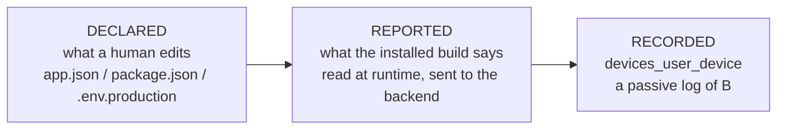
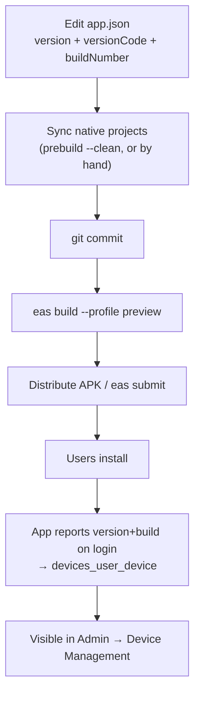
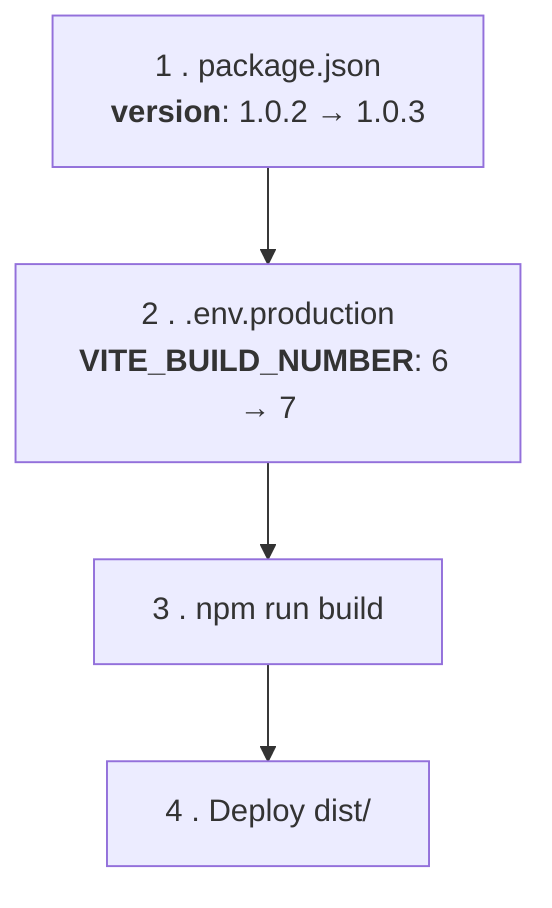
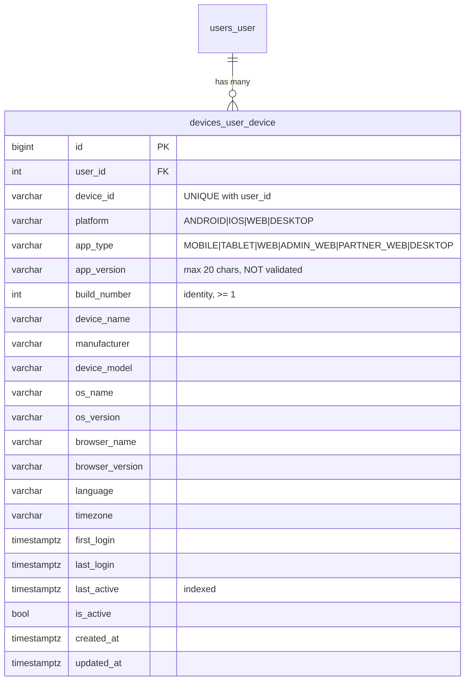

# OMS Release Runbook — Versions, Builds & Device Tracking

This is the official release runbook for OMS. It explains how to ship a new
version of the **mobile app** and the **React web app**, how version numbers are
decided, where every number lives, and how the backend records which version
each user is actually running.

It is written for a developer who has **never** released this project before.
If you follow it top to bottom, you cannot get it wrong.

> **The app is the sole source of truth for its own version and build.**
> There is nothing to configure server-side, and **no admin action after a
> deploy**. The backend does not decide what "should" be running, does not
> compare builds, and does not tell anyone to upgrade. It records what the
> clients report, and the admin dashboard displays it. That is the whole
> contract.

The system spans three apps that all talk to **one** Django backend:

| App | Location | What it reports |
| --- | --- | --- |
| Django backend | `OMS Backend/` | Stores the device inventory |
| React web (Vite) | `OMS Frontend-web/` | Web version, build, browser, OS |
| React Native (Expo) | `OMS-app/` | Native app version, build, device |

---

## Table of contents

1. [Versioning strategy (Semantic Versioning)](#1-versioning-strategy-semantic-versioning)
2. [Build number strategy](#2-build-number-strategy)
3. [Version vs build number](#3-version-vs-build-number--the-single-most-important-idea)
4. [Where every number lives (exact paths)](#4-where-every-number-lives-exact-paths)
5. [Mobile release process](#5-mobile-release-process)
6. [React web release process](#6-react-web-release-process)
7. [Device tracking](#7-device-tracking)
8. [Admin — Device Management](#8-admin--device-management)
9. [Useful SQL queries](#9-useful-sql-queries)
10. [Build warnings & common pitfalls](#10-build-warnings--common-pitfalls)
11. [Troubleshooting](#11-troubleshooting)
12. [Release checklist](#12-release-checklist)
13. [Rules and best practices](#13-rules-and-best-practices)
14. [Example: patch release 1.0.2 → 1.0.3](#14-example-patch-release-102--103)
15. [Future CI/CD automation plan](#15-future-cicd-automation-plan)

---

## 1. Versioning strategy (Semantic Versioning)

Every OMS app uses **Semantic Versioning**: `MAJOR.MINOR.PATCH` — three numbers
separated by dots, e.g. `1.2.0`.

```
        1    .    2    .    0
        │         │         │
        │         │         └── PATCH — bug fixes only
        │         └──────────── MINOR — new features, nothing breaks
        └────────────────────── MAJOR — something breaks
```

| Part | Increment when | Example |
| --- | --- | --- |
| **MAJOR** | The app can no longer talk to a current backend, or vice versa. A breaking API or data change. | `1.4.2` → `2.0.0` |
| **MINOR** | You added a user-facing feature. Old versions keep working. | `1.4.2` → `1.5.0` |
| **PATCH** | You only fixed bugs. No new surface. | `1.4.2` → `1.4.3` |

**Rules**

- When you bump MINOR, PATCH resets to `0` → `1.4.2` becomes `1.5.0`, never `1.5.2`.
- When you bump MAJOR, both reset → `1.5.3` becomes `2.0.0`.
- Never skip numbers. Never use `v` in the number itself (`1.2.0`, not `v1.2.0`).
- Never use four parts. `1.2.0.5` is not a version.

> **Note — how to decide if it's MAJOR.**
> Ask: *"If a user never updates, will the app break?"*
> If **yes** → MAJOR. If **no** → MINOR or PATCH.
> A MAJOR release is a coordination problem, not a switch you flip: the backend
> must stay backward compatible until the old clients are gone. Nothing in this
> system blocks, prompts, or locks out an old client.

> **Warning — nothing validates the version format any more.**
> `devices_user_device.app_version` is a plain `CharField(max_length=20)`
> (`OMS Backend/devices/models.py`) and the register serializer accepts any
> string that fits. The semver regex that used to reject `v1.2` and `1.2.0-beta`
> lived on the deleted release model and is **gone**. Semver is now a
> **convention the apps must keep**, enforced by review, not by a 400. If you
> ship `expo.version: "1.2"`, the backend will store `1.2` without complaint and
> the admin table will show it.

---

## 2. Build number strategy

A **build number** is a plain integer that increases by 1 for **every build that
leaves the pipeline** — including builds you never release.

```
version:  1.0.2   1.0.2   1.0.3   1.0.3   1.1.0
build:      41  →   42  →   43  →   44  →   45
                    ↑
            same version, rebuilt → build still goes up
```

It is a **serial number, not a count of releases.**

| App | Where the build number comes from |
| --- | --- |
| **Android** | `OMS-app/app.json` → `expo.android.versionCode` — **typed by hand.** See the warning in [§10](#10-build-warnings--common-pitfalls): the committed `android/` project must agree. |
| **iOS** | `OMS-app/app.json` → `expo.ios.buildNumber` — **typed by hand.** Same caveat. |
| **Web** | `OMS Frontend-web/.env.production` → `VITE_BUILD_NUMBER` — typed by hand, one line, committed with the release. `vite.config.ts` reads it with Vite's `loadEnv()` and inlines it. There is **no fallback**: if it is missing or not a positive whole number, **the build fails**. |

> **Warning — build numbers are only comparable *within a platform*.**
> Android build 45 and iOS build 45 are unrelated counters that will drift apart
> the moment iOS ships. A chart of "build 42" spanning Android and Web is
> meaningless, which is why every analytics query groups by platform and why the
> device table is indexed on `(platform, app_type, build_number)`.

> **Note — build numbers must still only ever increase.**
> Nothing compares them to decide who is outdated any more — that machinery is
> gone. But a build number's job is to **identify a build**, and the Device
> Management table sorts and filters on it. Reuse one and two different binaries
> become indistinguishable in the inventory; go backwards and the sort lies about
> what shipped when. Increment, always.
>
> This matters concretely for web: see the *"web build number restarted at 6"*
> note in [§10](#10-build-warnings--common-pitfalls).

---

## 3. Version vs build number — the single most important idea

This confuses everyone once. Read this section twice.

| | Version (`1.0.3`) | Build number (`43`) |
| --- | --- | --- |
| **Who is it for?** | Humans | Machines |
| **Format** | Three dotted numbers | One integer |
| **Can it repeat?** | Yes — you can build `1.0.3` ten times | **Never** |
| **Identifies a build?** | **No** | **Yes** |
| **Where shown** | Login footer, Profile, store listing | Profile, admin table |

**Why you never sort or compare version strings:**

```
"1.10.0" < "1.9.0"   →   TRUE   (as text: "1" then "0" comes before "9")
     58  <     60    →   TRUE   (as integers: correct)
```

Comparing text says `1.10.0` is *older* than `1.9.0`. The backend no longer makes
any such comparison — but the moment you write a report, a query, or a dashboard
sort, you will be tempted to. Don't.

> **Rule: the version string is a label. The build number is the identity.**
> Sort, filter and group by the **integer**. Show the string to humans.

---

## 4. Where every number lives (exact paths)

### The two tiers

Do not think of "the version" as one value. There are two tiers, each with
exactly one owner. Confusing them is how this project once ended up with five
different version numbers.



There used to be a third tier — a server-side *policy* saying what **should** be
running. It is gone. `RECORDED` is a mirror of `REPORTED`, nothing more.

| Tier | Mobile | Web |
| --- | --- | --- |
| **Declared** | `app.json` → `expo.version`, `expo.android.versionCode`, `expo.ios.buildNumber` | `package.json` → `version`; `.env.production` → `VITE_BUILD_NUMBER` |
| **Reported** | `expo-application` native values | `__APP_VERSION__` / `__APP_BUILD_NUMBER__` build constants |
| **Recorded** | `devices_user_device` row | `devices_user_device` row |

### Mobile — exact files

| What | Exact path | Current value | Edit by hand? |
| --- | --- | --- | --- |
| **Version** | `OMS-app/app.json` → `expo.version` | `1.0.2` | ✅ **YES** |
| **Android build** | `OMS-app/app.json` → `expo.android.versionCode` | `3` | ✅ **YES** |
| **iOS build** | `OMS-app/app.json` → `expo.ios.buildNumber` | `"3"` | ✅ **YES** |
| Android native | `OMS-app/android/app/build.gradle` | `versionCode 1`, `versionName "1.0"` | ⚠️ **Committed and out of sync — read [§10](#10-build-warnings--common-pitfalls)** |
| iOS native | `OMS-app/ios/OMSAPP.xcodeproj/project.pbxproj` | `MARKETING_VERSION 1.0.2`, `CURRENT_PROJECT_VERSION 2` | ⚠️ **Committed and out of sync — read [§10](#10-build-warnings--common-pitfalls)** |
| EAS config | `OMS-app/eas.json` | `appVersionSource: "local"` | ❌ No |
| Runtime reader | `OMS-app/src/services/device.service.ts` | `getAppVersion()` / `getBuildNumber()` | — |

> **Warning — the mobile numbers above currently disagree with each other.**
> Both native folders are **committed to git**, and they hold different values
> from `app.json`. Which one ends up in the binary depends on your build path.
> This is the single biggest trap in this repo and it has its own section:
> [§10](#10-build-warnings--common-pitfalls). Read it before your first mobile
> release.

> **Warning — never reintroduce a hardcoded version.**
> This app used to have `APP_CONFIG.VERSION = '1.0.1'` in
> `OMS-app/src/constants/config.ts`, hand-typed, shown on the login screen —
> and it had silently drifted out of sync with the real build. It was deleted.
> The version is now read from the **native binary** at runtime. If you ever
> feel tempted to add a version constant back, don't: a constant can drift, and
> it already did.

> **Note — `OMS-app/package.json` → `version` is npm metadata only.**
> It is not the app version. Ignore it.

### Web — exact files

**The two files you edit before every web release — and nothing else:**

| What | Exact path | Current value | Edit by hand? |
| --- | --- | --- | --- |
| **Version** | `OMS Frontend-web/package.json` → `version` | `0.0.0` ⚠️ | ✅ **YES — edit before every release** |
| **Build number** | `OMS Frontend-web/.env.production` → `VITE_BUILD_NUMBER` | `6` | ✅ **YES — edit before every release** |

Everything below is machinery. It is listed so you can find it, not so you can
edit it:

| What | Exact path | Role |
| --- | --- | --- |
| Env loading | `OMS Frontend-web/vite.config.ts` → `loadEnv(mode, process.cwd(), '')` | Reads `.env.production` at build time |
| Injection | `OMS Frontend-web/vite.config.ts` → `define` | `__APP_VERSION__`, `__APP_BUILD_NUMBER__` |
| TypeScript types | `OMS Frontend-web/src/vite-env.d.ts` | `declare const __APP_VERSION__` |
| Runtime reader | `OMS Frontend-web/src/services/webDeviceService.ts` | `getAppVersion()` / `getBuildNumber()` |
| Local dev only | `OMS Frontend-web/.env` (gitignored) | `VITE_API_BASE_URL`; **not** used for release numbers |

> **`.env.production` is meant to be committed, and `.gitignore` has an explicit
> exception for it.** A build number is a fact about a release, so it should be
> reviewed in the diff and tracked in git like any other release artifact.
>
> ```gitignore
> .env*              # ignored by default — machine-specific values
> !.env.example      # ...except the template
> !.env.production   # ...and the release build number
> ```
>
> **Warning — verified today, `.env.production` is NOT actually committed.**
> The file exists on disk with `VITE_BUILD_NUMBER=6` and `git check-ignore`
> confirms the `!.env.production` exception is working, but `git status` still
> reports it as untracked (`??`). Nobody ever ran `git add`. **A fresh clone has
> no `.env.production`, and with no fallback `npm run build` stops immediately.**
> Commit it with your next web release.
>
> **Never put a secret in `.env.production`.** Everything Vite inlines is shipped
> to the browser, so it is public the moment you deploy — committing it changes
> nothing about that. Machine-specific and sensitive values belong in `.env`,
> which stays ignored.
>
> `.env` (gitignored, local) is a *different file* for a *different job*. Do not
> put `VITE_BUILD_NUMBER` there — for a production build `.env.production` wins
> anyway, and having it in two places is how a stale number ships.

> **Warning — the web version is still `0.0.0`.**
> It is reported honestly (the app really is `0.0.0`), but that is not a real
> release version. **Before the next web release, set
> `OMS Frontend-web/package.json` → `"version": "1.0.0"`** and adopt semver from
> there. This is a one-line change and a team decision, not a technical one.

---

## 5. Mobile release process

### What you need once

- An Expo/EAS account with access to project `84e289e4-359a-4c6d-b656-0f52dc5bf4b8`
  (see `OMS-app/app.json` → `expo.extra.eas.projectId`).
- `npm install -g eas-cli`, then `eas login`.

### Steps

**Three numbers by hand, then build, then deploy. No admin step afterwards.**

```bash
cd "OMS-app"
```

**1. Bump the version** in `OMS-app/app.json`:

```jsonc
{
  "expo": {
    "version": "1.0.3",   // ← was 1.0.2
```

**2. Bump the Android build number** in the same file:

```jsonc
    "android": {
      "versionCode": 4,   // ← was 3. Integer. Never reuse, never go backwards.
```

**3. Bump the iOS build number** in the same file:

```jsonc
    "ios": {
      "buildNumber": "4", // ← was "3". A STRING on iOS. Apple rejects a re-used one.
```

> **Warning — read [§10](#10-build-warnings--common-pitfalls) before you build.**
> `android/` and `ios/` are committed native projects holding their **own**
> version numbers, and they do not currently match `app.json`. Editing `app.json`
> alone may not change what ships. §10 explains exactly what to check.

**4. Keep the native projects in step.** Either regenerate them from `app.json`:

```bash
npx expo prebuild --clean       # rewrites android/ and ios/ from app.json
```

…or, if you are not regenerating, make the committed native files agree by hand
(`android/app/build.gradle` → `versionCode`/`versionName`;
`ios/OMSAPP.xcodeproj/project.pbxproj` → `CURRENT_PROJECT_VERSION`/
`MARKETING_VERSION`). **Do not skip this step and hope.** See §10.

**5. Commit.**

```bash
git add app.json android ios
git commit -m "chore: mobile release 1.0.3 (build 4)"
```

**6. Build the APK / AAB.**

```bash
eas build --platform android --profile preview      # APK (distribution: internal)
```

> **Warning — there is no `production` build profile.**
> `OMS-app/eas.json` defines exactly two build profiles: `development` and
> `preview`. (`production` exists only under `submit`.) The command
> `eas build --profile production` — which older docs and muscle memory both
> suggest — **does not match anything in this repo**. Use `preview`, or add a
> `production` build profile to `eas.json` deliberately and update this section.

**7. Deploy** — distribute the APK internally, or submit to the store:

```bash
eas submit --platform android --profile production
```

**That's it.** Nothing to record anywhere. The next time a user logs in, the app
reports its version and build and the row appears in Device Management.

### Mobile release flow



> **Note — a native rebuild is required for native changes.**
> Adding a native module (for example `expo-device`) means existing installs
> **cannot** pick it up without a new binary. There is no OTA (`expo-updates` is
> not installed), so every mobile change ships as a build.

---

## 6. React web release process

**Two files. Both by hand. Every release.**



No environment variable on the command line. No CI variable. No git magic. No
admin step. Edit two files, build, deploy.

### Steps

```bash
cd "OMS Frontend-web"
```

**1. Bump the version** in `OMS Frontend-web/package.json` — the only place a
web version is ever written:

```diff
  {
    "name": "oms-web",
-   "version": "1.0.2",
+   "version": "1.0.3",
  }
```

**2. Bump the build number** in `OMS Frontend-web/.env.production` — the only
place a web build number is ever written:

```diff
- VITE_BUILD_NUMBER=6
+ VITE_BUILD_NUMBER=7
```

It must be a **whole number ≥ 1** and must be **higher than the previous
release's**. Never reuse one, never go backwards — see the note in
[§2](#2-build-number-strategy).

**3. Commit both files together.** They describe one release; splitting them is
how they drift apart.

```bash
git add package.json .env.production
git commit -m "chore: web release 1.0.3 (build 7)"
```

**4. Build.**

```bash
npm run build
```

The build prints exactly what it baked in — **check this line before deploying**:

```
[vite] building version 1.0.3, build 7 (VITE_BUILD_NUMBER from .env.production)
```

**5. Deploy `dist/`** to the web host / reverse proxy as you normally do.

**That's it.** No admin step.

### If the build stops

Missing or malformed build number — this is the guard doing its job, not a bug:

```
  Build stopped: VITE_BUILD_NUMBER is not set.

  Set it in "OMS Frontend-web/.env.production", then rebuild:

      VITE_BUILD_NUMBER=42
```

Fix `.env.production` and build again. Do **not** work around it by passing a
variable on the command line — the number belongs in the file, in the commit,
in the diff.

> **Note — how the two numbers reach the browser.**
> `vite.config.ts` reads `package.json` (version) and `.env.production` (build
> number) at build time and inlines both with Vite's `define`. The published
> bundle literally contains `function(){return 7}` — there is no runtime lookup
> to get out of sync, which is why the reported build **always** matches the
> deployed one.

> **Warning — `npm run build` is currently broken on `main`.**
> The build script is `tsc -b && vite build`. `tsc -b` currently fails with 7
> pre-existing unused-variable errors (`TS6133`) in files unrelated to
> releases — see [§10](#10-build-warnings--common-pitfalls). `npx vite build`
> alone succeeds. **Fix the unused variables** rather than skipping `tsc`.

---

## 7. Device tracking

One table, in the `devices` Django app (`OMS Backend/devices/models.py`).
**Never create a duplicate device table.**

### Client endpoints

| Endpoint | Purpose |
| --- | --- |
| `POST /api/devices/register/` | Called after each successful login. Upserts the device row with version, build, platform, hardware, OS/browser. |
| `POST /api/devices/update/` | Updates a subset of fields / refreshes activity. |
| `GET /api/devices/me/` | The current user's own devices (Profile screen). |

Every API request also carries the reported version as an `X-App-Version` header.

> **Note — registration is best-effort telemetry.**
> It never blocks login. A failure is swallowed and retried on the next
> successful authentication (login or token refresh). "Registration failed" in
> the logs is by design, not an incident.

### `devices_user_device` — one row per install, per user

Written automatically by the apps. **You never edit this by hand.**



| Constraint / index | Name | Why it exists |
| --- | --- | --- |
| `UNIQUE (user_id, device_id)` | `device_user_deviceid_uq` | Per **user**, not global — a shared warehouse tablet used by two staff is legitimately two rows, and a forged `device_id` can only ever touch the forger's own row. |
| `INDEX (user_id, is_active)` | `device_user_active_idx` | "This user's devices" (Profile page). |
| `INDEX (platform, app_type, build_number)` | `device_plat_build_idx` | Version-distribution analytics. |
| `INDEX (last_active)` | `device_last_active_idx` | Last-seen / retention sweeps. |

> **Note — activity status is not stored.**
> `Online / Idle / Offline / Inactive` is **computed** from `last_active`
> (`OMS Backend/devices/status.py`): online ≤ 5 min, idle ≤ 30 min, offline ≤ 30
> days, inactive beyond that. There is no `status` column and there must never
> be one — a stored status would be stale the moment it was written.
>
> The rules live in one module shared by the serializer (row badge), the list
> filter (`?status=online|idle|offline|inactive`) and the analytics cards, so a
> filtered list, its badges and the summary can never disagree. The **server**
> computes it: a client with a skewed clock would otherwise render a badge that
> contradicts the filter it just asked for.

> **Note — `last_active` writes are throttled to 15 minutes**
> (`LAST_ACTIVE_THROTTLE_SECONDS` in `OMS Backend/devices/services.py`), so a
> chatty client does not cause a database write per API request.

---

## 8. Admin — Device Management

**One** admin page, under **System** in the sidebar. Visible to users with the
`admin` role, or to anyone granted the page on the **Permissions** screen.

| Page | Path | Use it to |
| --- | --- | --- |
| Device Management | `/Device_Management` | Full device inventory, live activity, version distribution |

> **Note — Device Management absorbed the old Device Activity page.**
> There is now **one** System page carrying both the live Online/Idle/Offline
> cards and the inventory. `Device_Activity` and `Version_Management` are gone,
> and both are deliberately no longer grantable on the Permissions screen
> (`OMS Frontend-web/src/config/adminPages.ts`) — the pages they gated do not
> exist, so the grants would unlock nothing. Any stored grant with those keys is
> simply ignored.

### What the page shows

**Summary cards** — served by `GET /api/admin/devices/analytics/`:

| Card | Meaning |
| --- | --- |
| Online / Idle / Offline | Derived live from `last_active` ([§7](#7-device-tracking)) |
| Total Devices | Every row |
| Active / Inactive | `is_active` |
| Mobile / Web | By `app_type` / `platform` |

**Device table** — served by `GET /api/admin/devices/`:

| Column | Sortable? |
| --- | --- |
| Status | ❌ — derived from `last_active`, not a stored column, so it is a plain header rather than a sort that would silently do nothing |
| Name (user) | ✅ `user__name` |
| App Type | ✅ `app_type` |
| Version | ✅ `app_version` |
| Build | ✅ `build_number` |
| Relative (last active) | ✅ `last_active` |

Selecting a row opens the detail panel: Platform, Device, Browser, OS, Last
Active, and the rest of the reported fields
(`GET /api/admin/devices/<pk>/`).

> **Note — this page is a report, not a control panel.**
> There is no action here that changes what any client does. It shows what the
> fleet told the backend. If a number looks wrong, the fix is in the app that
> reported it, not here.

---

## 9. Useful SQL queries

Run against the OMS PostgreSQL database. All are read-only.

**Version distribution (who is on what):**

```sql
SELECT platform, app_type, app_version, build_number, COUNT(*) AS devices
FROM devices_user_device
GROUP BY platform, app_type, app_version, build_number
ORDER BY platform, build_number DESC;
```

**Adoption of a specific build (Android build 4):**

```sql
SELECT
  COUNT(*) FILTER (WHERE build_number = 4) AS on_this_build,
  COUNT(*)                                 AS total,
  ROUND(100.0 * COUNT(*) FILTER (WHERE build_number = 4) / NULLIF(COUNT(*),0), 2)
    AS adoption_percent
FROM devices_user_device
WHERE platform = 'ANDROID' AND app_type = 'MOBILE';
```

**Live activity buckets (mirrors the summary cards):**

```sql
SELECT
  COUNT(*) FILTER (WHERE last_active >= NOW() - INTERVAL '5 minutes')  AS online,
  COUNT(*) FILTER (WHERE last_active >= NOW() - INTERVAL '30 minutes'
                     AND last_active <  NOW() - INTERVAL '5 minutes')  AS idle,
  COUNT(*) FILTER (WHERE last_active >= NOW() - INTERVAL '30 days'
                     AND last_active <  NOW() - INTERVAL '30 minutes') AS offline,
  COUNT(*) FILTER (WHERE last_active <  NOW() - INTERVAL '30 days')    AS inactive
FROM devices_user_device;
```

**One user's devices:**

```sql
SELECT d.device_id, d.platform, d.app_type, d.app_version, d.build_number,
       d.browser_name, d.os_name, d.os_version, d.last_active
FROM devices_user_device d
JOIN users_user u ON u.id = d.user_id
WHERE u.username = 'someone'
ORDER BY d.last_active DESC;
```

**Browser breakdown (web only):**

```sql
SELECT browser_name, browser_version, COUNT(*) AS devices
FROM devices_user_device
WHERE platform = 'WEB'
GROUP BY browser_name, browser_version
ORDER BY devices DESC;
```

**Malformed versions (nothing validates the format — check occasionally):**

```sql
SELECT DISTINCT platform, app_type, app_version
FROM devices_user_device
WHERE app_version !~ '^\d+\.\d+\.\d+$'
ORDER BY platform, app_version;
```

---

## 10. Build warnings & common pitfalls

Everything in this section was **verified against the current source code**, not
recalled from memory. Each item states what is true *today*, where to look, and
what to do about it. If you change the code, re-verify before trusting this.

These are the things that have actually cost developers time on this project.

---

### 1. Mobile versioning: `app.json` and the committed native projects disagree

This is the biggest trap in the repo. Read all of it.

**Verified facts:**

| File | Setting | Value |
| --- | --- | --- |
| `OMS-app/eas.json` | `cli.appVersionSource` | `"local"` |
| `OMS-app/eas.json` | build profiles | `development`, `preview` — **no `production`** |
| `OMS-app/eas.json` | `autoIncrement` | **absent everywhere** |
| `OMS-app/app.json` | `expo.version` | `1.0.2` |
| `OMS-app/app.json` | `expo.android.versionCode` | `3` |
| `OMS-app/app.json` | `expo.ios.buildNumber` | `"3"` |
| `OMS-app/android/app/build.gradle` | `versionCode` / `versionName` | `1` / `"1.0"` |
| `OMS-app/ios/…/project.pbxproj` | `CURRENT_PROJECT_VERSION` / `MARKETING_VERSION` | `2` / `1.0.2` |
| git | `android/` and `ios/` | **tracked** (52 files under `android/` alone) |

**What changed.** This document previously said EAS remote versioning owned the
build number (`appVersionSource: "remote"`, `autoIncrement: true`), that you
never type a build number, and that `app.json` → `ios.buildNumber` and
`build.gradle` → `versionCode` were **ignored and generated**. **That is no
longer true.** `eas.json` now sets `appVersionSource: "local"`, there is no
`autoIncrement`, and `app.json` has since gained a real
`expo.android.versionCode`. Nothing increments a build number for you any more —
which is exactly why [§5](#5-mobile-release-process) tells you to type all three
numbers by hand. If you find older notes claiming "EAS manages it, don't touch
it", they predate this change.

> **Warning — with the native folders committed, `app.json` may not be what
> ships.** Expo only writes `app.json`'s values into `android/` and `ios/` when
> it **generates** them (`expo prebuild`). Those folders are checked in here — the
> `postinstall` script `scripts/patch-android-cmake.js` even patches the Android
> project in place — so a build that consumes the existing native project takes
> its version from `build.gradle` / `project.pbxproj`, **not** from `app.json`.
> The numbers above are the evidence: someone bumped `app.json` to `3`/`3` while
> `build.gradle` still says `1` and the Xcode project says `2`. Those edits went
> nowhere.

**What to do.** Pick one and be consistent:

- **Regenerate (recommended).** Run `npx expo prebuild --clean` as part of the
  release so `android/` and `ios/` are rewritten from `app.json`. `app.json`
  stays the single source of truth. Commit the regenerated native folders.
- **Or hand-maintain.** Treat `build.gradle` and `project.pbxproj` as real source
  and bump them alongside `app.json` every time. More places to forget, but no
  regeneration surprises.

**Either way, verify the number you actually shipped** — do not assume. Check the
build output, or install the artifact and read the build on the Profile screen /
in Device Management. The client reports
`Application.nativeBuildVersion` — the value compiled into the **binary**
(`OMS-app/src/services/device.service.ts`), so what the admin table shows is the
ground truth about what you built.

---

### 2. The client reports the *binary*, not `app.json`

`OMS-app/src/services/device.service.ts` reads both numbers from native metadata
at runtime, with a manifest fallback that only fires in Expo Go / dev builds
where `expo-application` returns `null`:

```ts
Application.nativeApplicationVersion || Constants.expoConfig?.version || ''
Application.nativeBuildVersion ?? (ios ? expoConfig.ios.buildNumber
                                       : expoConfig.android.versionCode)
```

The version is attached to every API request as `X-App-Version` and both are sent
in the `POST /api/devices/register/` body after each login.

**This is why pitfall 1 matters:** on a real build these read what was *compiled*,
so Device Management shows the truth about your binary — not what `app.json`
claims. It is also why you must never confirm a version in Expo Go.

> **Note — iOS build numbers are strings, and Apple enforces them.**
> `expo.ios.buildNumber` is `"4"`, not `4`. On iOS the value becomes
> `CFBundleVersion`, and **App Store Connect rejects a re-used build number**
> even when the version is unchanged — the one place a duplicate causes a hard
> error rather than a quiet inconsistency. iOS has not shipped yet
> (`MARKETING_VERSION 1.0.2`, `CURRENT_PROJECT_VERSION 2`); when it does, its
> counter is independent of Android's and will drift immediately
> ([§2](#2-build-number-strategy)).

---

### 3. Web — which env file is read, and which wins

**Where the web version and build number actually come from (verified by reading
`vite.config.ts` and the emitted bundle):**

| Value | Real source |
| --- | --- |
| Version | `OMS Frontend-web/package.json` → `"version"` — currently **`0.0.0`** |
| Build number | `OMS Frontend-web/.env.production` → `VITE_BUILD_NUMBER` (**no fallback — build fails without it**) |
| Env loading | `OMS Frontend-web/vite.config.ts` → `loadEnv(mode, process.cwd(), '')` |
| Injection | `vite.config.ts` → `define` → `__APP_VERSION__`, `__APP_BUILD_NUMBER__` |
| Runtime reader | `OMS Frontend-web/src/services/webDeviceService.ts` |

**Which file wins.** Vite loads `.env` first, then `.env.<mode>` on top, then a
real OS/CI environment variable on top of *both*. `npm run build` runs in mode
`production`:

| Set where | Effect on `npm run build` |
| --- | --- |
| `.env.production` | ✅ **the intended place** — this is the release's build number |
| `.env` | ⚠️ loaded, but `.env.production` overrides it — do not put it here |
| OS / CI environment | ⚠️ **overrides `.env.production`** — see the warning below |

> **Warning — a stray shell variable silently outranks the file.**
> `loadEnv` gives the real environment the last word, so an old
> `export VITE_BUILD_NUMBER=4` left in a shell profile will beat
> `.env.production` and ship the wrong number. The build log names its source
> for exactly this reason — read it:
>
> ```
> [vite] building version 1.0.3, build 7 (VITE_BUILD_NUMBER from .env.production)
> [vite] building version 1.0.3, build 4 (VITE_BUILD_NUMBER from the environment — overriding .env.production)
> ```
>
> If you see the second form and did not intend it, unset the variable.

**Still true — `VITE_APP_VERSION` is read by nothing.** Do not add it. The
version comes from `package.json`, which keeps one source of truth per app.

**What `.env` is still for.** `VITE_API_BASE_URL`, read by *client* code via
`import.meta.env`. `.env` is gitignored and machine-specific; `.env.production`
is committed and describes the release. Different files, different jobs — keep
the build number out of `.env`.

---

### 4. The web build number restarted at 6

Builds made before manual numbering derived their number from the **git commit
count** and reported values around **118–131**. Manual numbering restarts at
**6**, so the sequence currently runs *backwards* relative to anything already
deployed.

**This no longer breaks anything functional.** There is no upgrade prompt, and
the backend does not compare builds to decide who is outdated — that machinery is
deleted. What it does break is **reading the data**: sort the Device Management
table by Build and a stale git-count client (`128`) sorts above your newest
release (`7`), which looks like it is ahead when it is two years behind.

**What to do:** either bump `VITE_BUILD_NUMBER` past the highest number ever
shipped and carry on from there, or accept the overlap and clear out stale `WEB`
rows in `devices_user_device` once you have confirmed no such build is still in
the field. Either is defensible; drifting without deciding is not.

---

### 5. Never clear `device_id` on logout

Each install/browser generates one opaque `device_id` and keeps it **forever**.
It is what makes `devices_user_device` count *devices* instead of *logins*.

**Verified — it is currently preserved in all three places that clear storage:**

| File | Mechanism | `device_id` present? |
| --- | --- | --- |
| `OMS-app/src/utils/storage.ts` | `clear()` removes only `ACCESS_TOKEN`, `REFRESH_TOKEN`, `USER`, `HIDDEN_NOTIFICATION_IDS` | ❌ correctly absent |
| `OMS Frontend-web/src/services/api.ts` | `AUTH_STORAGE_KEYS` | ❌ correctly absent |
| `OMS Frontend-web/src/components/Sidebar.tsx` | `clearSessionStorage()` | ❌ correctly absent |

> **Warning — adding `device_id` to any of those lists corrupts the database.**
> Every logout would mint a **brand-new device id**, so the next login inserts a
> **new row** instead of updating the existing one. One user logging in and out
> ten times becomes ten "devices". There is no error, no exception, and no log
> line — the device count simply inflates, version analytics skew toward
> whatever the frequent-logout users run, and the data is unrecoverable after
> the fact.
>
> The mobile app already demonstrates the correct pattern: `clear()` also
> deliberately preserves `notification_permission_state`. Treat `device_id` the
> same way. Each list carries a comment saying so — **do not remove it.**

> **Note — expected regeneration.**
> An Android **reinstall** legitimately produces a new `device_id` (app storage
> is wiped). That is accepted and self-corrects as the old row ages out. iOS
> Keychain usually survives reinstall, so iOS behaves differently — do not
> compare Android and iOS device counts and draw conclusions about churn.

---

### 6. Known build issues (pre-existing)

> **Warning — `npm run build` currently fails on the web app.**
> This is **not** caused by the device-tracking work and has nothing to do with
> releases. It exists on `main` independently and blocks any typechecked web
> build.

The build script is `tsc -b && vite build`. The `tsc -b` step fails with **7
`TS6133` errors** ("declared but its value is never read"):

| File | Line | Unused symbol |
| --- | --- | --- |
| `OMS Frontend-web/src/components/order-items/ItemCard.tsx` | 8 | `LuEllipsisVertical` |
| `OMS Frontend-web/src/components/order-items/ItemCard.tsx` | 13 | `LuUsers` |
| `OMS Frontend-web/src/components/order-items/ItemCard.tsx` | 18 | `ApprovalAvatar` |
| `OMS Frontend-web/src/components/order-items/ItemCard.tsx` | 43 | `approvers` |
| `OMS Frontend-web/src/pages/App_User.tsx` | 59 | `setShowPassword` |
| `OMS Frontend-web/src/pages/Order_Status_Tracking.tsx` | 297 | `hasQuotationNumber` |
| `OMS Frontend-web/src/pages/Order_Status_Tracking.tsx` | 298 | `isCompletedOrder` |

They surface because `tsconfig.app.json` sets `"noUnusedLocals": true`.

**Fix properly:** delete the unused imports/variables in those three files.
`npx vite build` alone succeeds, so it is tempting to skip `tsc` — **don't**.
That would disable typechecking for the whole project to avoid deleting seven
dead lines.

---

## 11. Troubleshooting

### "The app shows the wrong version"

The version is read from the **native binary**, not from JS. Check
`OMS-app/src/services/device.service.ts` → `getAppVersion()`. In Expo Go or a
dev build, `expo-application` may return `null` and the code falls back to
`app.json`. **Always confirm the version on a real production build**, not in
Expo Go.

### "I bumped `app.json` but the build number didn't change"

The committed `android/` / `ios/` native projects hold their own numbers and are
what get built. This is pitfall 1 in [§10](#10-build-warnings--common-pitfalls) —
the single most common mobile mistake in this repo.

### "`eas build --profile production` says the profile doesn't exist"

Correct — `OMS-app/eas.json` defines only `development` and `preview` build
profiles. Use `--profile preview` for an APK, or add a `production` profile
deliberately. See [§5](#5-mobile-release-process).

### "The device count keeps growing / users have dozens of devices"

Almost certainly the **device ID is being cleared on logout**. It must survive.

- Mobile: `OMS-app/src/utils/storage.ts` → `clear()` must **not** include
  `device_id` (it is deliberately omitted, next to `notification_permission_state`).
- Web: `OMS Frontend-web/src/services/api.ts` → `AUTH_STORAGE_KEYS` must **not**
  contain `device_id`, and `Sidebar.tsx` → `clearSessionStorage()` must not either.

If `device_id` is cleared, every logout mints a brand-new device — silently, with
no error.

### "Android reinstall created a new device"

**Expected.** Android storage is wiped on uninstall, so a reinstall generates a
new `device_id`. The old row simply stops reporting and ages out. iOS Keychain
usually survives reinstall, so iOS behaves differently — do not compare Android
and iOS device counts and conclude anything about churn.

### "Device Name is empty for iOS / some devices"

Expected today. `expo-device` is **not installed**. Android manufacturer/model
come from React Native's `Platform.constants`; iOS exposes no device name
without `expo-device`. Installing it requires a **native rebuild**.

### "The web build number never changes"

Nobody bumped it. It is typed by hand in `OMS Frontend-web/.env.production` →
`VITE_BUILD_NUMBER` and changes only when you edit that line — see
[§6](#6-react-web-release-process). Check the `[vite] building version …` line
the build prints: it states the value and the file it came from.

If that line says `from the environment — overriding .env.production`, a real
`VITE_BUILD_NUMBER` environment variable is set in your shell or CI and is
outranking the file (`loadEnv` lets the OS environment win). Unset it:

```bash
unset VITE_BUILD_NUMBER            # bash
Remove-Item Env:VITE_BUILD_NUMBER  # PowerShell
```

### "The web build fails with `Build stopped: VITE_BUILD_NUMBER …`"

Working as designed — there is deliberately no fallback. Set a positive whole
number in `OMS Frontend-web/.env.production` and rebuild. Note `12abc`, `3.7`,
`0` and `-5` are all rejected: only a bare integer ≥ 1 is accepted.

**On a fresh clone this is expected right now**: `.env.production` is not yet
committed ([§4](#4-where-every-number-lives-exact-paths)). Create it with the
current build number.

### "`npm run build` fails on the web app"

Pre-existing `tsc -b` errors unrelated to releases — see
[§10](#10-build-warnings--common-pitfalls).

### "A device shows a weird version like `1.2` or `dev`"

Nothing validates `app_version` any more — the semver regex lived on the deleted
release model. The client sent exactly that. Find the build that reports it and
fix the version there; the malformed-version query in
[§9](#9-useful-sql-queries) lists offenders.

### "Registration failed" in the app logs

Harmless by design. Device registration is best-effort telemetry: it never
blocks login and retries automatically on the next successful authentication
(login or token refresh).

---

## 12. Release checklist

Copy this into your release ticket.

**Before**

- [ ] All changes merged and tested.
- [ ] Decided MAJOR / MINOR / PATCH using the rule in [§1](#1-versioning-strategy-semantic-versioning).
- [ ] Backend deployed first if the release depends on new APIs.

**Mobile**

- [ ] `OMS-app/app.json` → `expo.version` bumped.
- [ ] `OMS-app/app.json` → `expo.android.versionCode` bumped (integer, higher than last).
- [ ] `OMS-app/app.json` → `expo.ios.buildNumber` bumped (string, higher than last).
- [ ] Native projects synced — `npx expo prebuild --clean`, **or** `build.gradle`
      and `project.pbxproj` updated by hand ([§10](#10-build-warnings--common-pitfalls)).
- [ ] Committed with a clear message.
- [ ] `eas build --platform android --profile preview` succeeded (**not**
      `--profile production` — it does not exist).
- [ ] **Verified the build number in the artifact**, not just in `app.json`.
- [ ] APK distributed / submitted to the store.

**Web** — the two files, both by hand:

- [ ] `OMS Frontend-web/package.json` → `version` bumped (not `0.0.0`).
- [ ] `OMS Frontend-web/.env.production` → `VITE_BUILD_NUMBER` bumped, higher
      than the last release.
- [ ] Both committed **together** (and `.env.production` actually `git add`ed —
      it is currently untracked).
- [ ] `npm run build` passes (including `tsc -b`).
- [ ] The printed `[vite] building version X, build Y` line matches what you
      intended to ship, and names `.env.production` as its source.
- [ ] `dist/` deployed.

**After**

- [ ] Log in on a real device; confirm Profile shows the new version and build.
- [ ] Confirm the new version/build appears in **System → Device Management**.
- [ ] Watch adoption there over the next few days.

> **There is no admin step.** If you are looking for the place to "record the
> release", there isn't one any more — that page and its API are gone. The device
> table reports whatever the clients send.

---

## 13. Rules and best practices

> **The rules. Breaking any of these has caused a real bug in this project or is
> guaranteed to cause one.**

1. **Never sort or compare version strings.** `"1.10.0" < "1.9.0"` is `true` as
   text. Use the build number integer.
2. **Build numbers are per-platform.** Never compare Android to iOS to Web.
3. **Build numbers only ever increase.** They identify a build; the admin table
   sorts on them. Never reuse, never go backwards. (Apple enforces this for you
   on iOS. Nothing enforces it anywhere else.)
4. **Never hardcode a version in JS.** Read it from the binary (mobile) or the
   build constant (web). A constant drifts; this one already did.
5. **`device_id` must survive logout.** Keep it out of every storage-clearing
   list.
6. **Version is telemetry, never authorization.** Every reported field is
   client-supplied and forgeable. Never gate a permission, price, or data scope
   on `app_version`/`build_number`. A spoofed client should only ever earn
   itself a broken experience.
7. **Never hand-edit generated native files *unless you have accepted that you
   maintain them*.** `build.gradle` and `project.pbxproj` are committed here, so
   they are either regenerated by `expo prebuild` or maintained by hand — pick
   one per [§10](#10-build-warnings--common-pitfalls) and never straddle.
8. **Verify what shipped, don't assume.** The reported build in Device Management
   is the ground truth about your binary. Check it after every mobile release.

**Also worth knowing**

- Registration is best-effort: a failure never blocks login, and it retries on
  the next successful auth.
- `last_active` writes are throttled (15 min) to avoid a database write per API
  request.
- Device data is **personal data** (device names, activity trails). Keep the
  admin page admin-only and honour the retention plan.

---

## 14. Example: patch release 1.0.2 → 1.0.3

**Scenario:** you fixed a crash on the order list. No new features. Backward
compatible.

**Which part?** Bug fix only → **PATCH** → `1.0.2` → `1.0.3`.

*(A new feature that doesn't break anything would be **MINOR**: `1.0.2` → `1.1.0`,
PATCH resetting to `0`. A change that breaks old clients would be **MAJOR**:
`2.0.0` — and would need the backend kept backward compatible until the old
clients are gone, because nothing locks anyone out.)*

### Mobile

**1.** Edit `OMS-app/app.json` — three numbers:

```diff
   "expo": {
     "name": "OMSAPP",
     "slug": "OMSAPP",
-    "version": "1.0.2",
+    "version": "1.0.3",
     ...
     "ios": {
-      "buildNumber": "3",
+      "buildNumber": "4",
     },
     "android": {
-      "versionCode": 3,
+      "versionCode": 4,
     }
```

**2.** Sync the native projects and commit:

```bash
cd "OMS-app"
npx expo prebuild --clean
git add app.json android ios
git commit -m "chore: mobile release 1.0.3 (build 4)"
```

**3.** Build and distribute:

```bash
eas build --platform android --profile preview
eas submit --platform android --profile production   # if going to the store
```

**4.** Verify — install it, log in, and check **System → Device Management**:
the row reports version `1.0.3`, build `4`. If it reports build `1`, the native
project wasn't synced; go back to [§10](#10-build-warnings--common-pitfalls).

### Web

**1.** Edit two files:

```diff
  // OMS Frontend-web/package.json
- "version": "1.0.2",
+ "version": "1.0.3",
```

```diff
  # OMS Frontend-web/.env.production
- VITE_BUILD_NUMBER=6
+ VITE_BUILD_NUMBER=7
```

**2.** Commit together, build, check the printed line, deploy `dist/`:

```
[vite] building version 1.0.3, build 7 (VITE_BUILD_NUMBER from .env.production)
```

### What users see

Nothing forces them and nothing prompts them. Mobile users update from the store
(or get the new APK); web users get the new bundle on next load. As they do, the
Device Management version distribution shifts from build 3 to build 4.

**There is no step 5.** No release to record, no "Mark as Latest", no admin
action at all.

---

## 15. Future CI/CD automation plan

Today every step is manual. This is the intended path, in order of value.

**Phase A — stop typing build numbers (web)**

Today the number is typed by hand in `.env.production`, which is a deliberate
trade: it is visible in the diff and requires no CI wiring. If you later want CI
to own it, set `VITE_BUILD_NUMBER` from the run number — `loadEnv` lets a real
environment variable outrank the file, so this works with no code change:

```yaml
# .github/workflows/web-release.yml (illustrative)
- name: Build web
  env:
    VITE_BUILD_NUMBER: ${{ github.run_number }}
  run: npm ci && npm run build
```

> **Warning — do not adopt this half-way.** The moment CI overrides the file,
> `.env.production` becomes a lie that still looks authoritative in the diff:
> the committed number is not what shipped. If you go this route, delete
> `VITE_BUILD_NUMBER` from `.env.production` in the same change so there is
> exactly one source again, and update [§6](#6-react-web-release-process). The
> build log names the source it used precisely so this is never ambiguous.

**Phase B — stop typing build numbers (mobile)**

Either switch `eas.json` to `appVersionSource: "remote"` with
`autoIncrement: true` and let EAS own the counter (which is what this project
used to do), or add a CI step that bumps `app.json` and runs `expo prebuild`.
Whichever you pick, resolve the `app.json`-vs-native-project split in
[§10](#10-build-warnings--common-pitfalls) first — automating on top of an
ambiguous source just makes the wrong number arrive faster.

**Phase C — tag-driven releases**

Trigger on `v*` tags; derive the version from the tag; fail the build if the tag
does not match `package.json` / `app.json`. This makes the git tag the source of
truth and makes drift impossible.

**Phase D — quality gates**

Run `python manage.py test devices` and the web `tsc -b` + `eslint` on every PR.

**Phase E — mobile in CI**

`eas build --non-interactive` on tag, then `eas submit`. Requires an EAS token
in CI secrets. Add a real `production` build profile to `eas.json` as part of
this.

---

## Quick reference

| I want to… | Do this |
| --- | --- |
| Release mobile | Bump `app.json` → `version` + `android.versionCode` + `ios.buildNumber`, sync native, `eas build --profile preview`, distribute |
| Release web | Bump `package.json` → `version` **and** `.env.production` → `VITE_BUILD_NUMBER`, `npm run build`, deploy `dist/` |
| Find the build number | Mobile: `app.json` — but **verify against the artifact** ([§10](#10-build-warnings--common-pitfalls)). Web: `.env.production` (the build prints it) |
| See who's on what | Admin → **System → Device Management** |
| See who's online now | Admin → **System → Device Management** (same page — activity cards at the top) |
| Record a release | **Nothing to do.** No admin action exists any more. |

**Key files, one more time**

```
OMS-app/app.json                                  ← mobile version + both build numbers (edit this)
OMS-app/eas.json                                  ← appVersionSource: local; profiles: development, preview
OMS-app/android/app/build.gradle                  ← committed native Android version (must agree)
OMS-app/ios/OMSAPP.xcodeproj/project.pbxproj      ← committed native iOS version (must agree)
OMS-app/src/services/device.service.ts            ← mobile version/build reader
OMS Frontend-web/package.json                     ← web version (edit this)
OMS Frontend-web/.env.production                  ← web build number (edit this)
OMS Frontend-web/vite.config.ts                   ← web version/build injection
OMS Frontend-web/src/services/webDeviceService.ts ← web version reader
OMS Backend/devices/models.py                     ← the device table
OMS Backend/devices/status.py                     ← activity status rules
OMS Backend/devices/admin_views.py                ← admin device APIs
```
