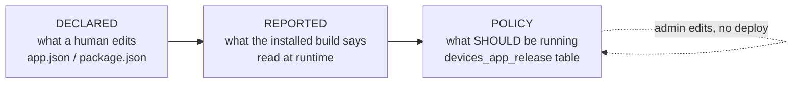
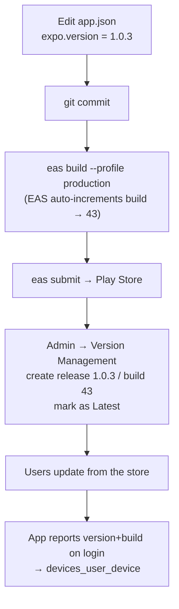
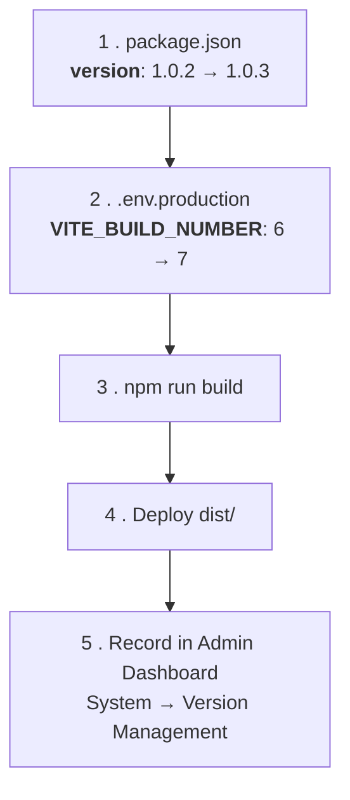
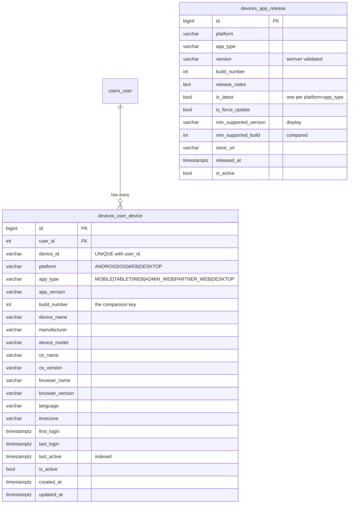

# OMS Release Guide — Versions, Builds & Device Tracking

This is the official release guide for OMS. It explains how to ship a new
version of the **mobile app** and the **React web app**, how version numbers are
decided, where every number lives, and how the backend tracks which version each
user is actually running.

It is written for a developer who has **never** released this project before.
If you follow it top to bottom, you cannot get it wrong.

The system spans three apps that all talk to **one** Django backend:

| App | Location | What it reports |
| --- | --- | --- |
| Django backend | `OMS Backend/` | Stores devices + release policy |
| React web (Vite) | `OMS Frontend-web/` | Web version, browser, OS |
| React Native (Expo) | `OMS-app/` | Native app version, build, device |

---

## Table of contents

1. [Versioning strategy (Semantic Versioning)](#1-versioning-strategy-semantic-versioning)
2. [Build number strategy](#2-build-number-strategy)
3. [Version vs Build Number](#3-version-vs-build-number--the-single-most-important-idea)
4. [Where every number lives (exact paths)](#4-where-every-number-lives-exact-paths)
5. [Mobile release process](#5-mobile-release-process)
6. [React web release process](#6-react-web-release-process)
7. [Database tables](#7-database-tables)
8. [Admin dashboard workflow](#8-admin-dashboard-workflow)
9. [Useful SQL queries](#9-useful-sql-queries)
10. [Troubleshooting](#10-troubleshooting)
11. [Release checklist](#11-release-checklist)
12. [Future CI/CD automation plan](#12-future-cicd-automation-plan)
13. [Rules and best practices](#13-rules-and-best-practices)
14. [Example: patch release 1.0.2 → 1.0.3](#14-example-patch-release-102--103)
15. [Example: feature release 1.0.3 → 1.1.0](#15-example-feature-release-103--110)

---

## 1. Versioning strategy (Semantic Versioning)

Every OMS app uses **Semantic Versioning**: `MAJOR.MINOR.PATCH` — three numbers
separated by dots, e.g. `1.2.0`.

```
        1    .    2    .    0
        │         │         │
        │         │         └── PATCH — bug fixes only
        │         └──────────── MINOR — new features, nothing breaks
        └────────────────────── MAJOR — something breaks
```

| Part | Increment when | Example |
| --- | --- | --- |
| **MAJOR** | The app can no longer talk to a current backend, or vice versa. A breaking API or data change. In practice: **this is the bump that forces everyone to upgrade.** | `1.4.2` → `2.0.0` |
| **MINOR** | You added a user-facing feature. Old versions keep working. | `1.4.2` → `1.5.0` |
| **PATCH** | You only fixed bugs. No new surface. | `1.4.2` → `1.4.3` |

**Rules for beginners**

- When you bump MINOR, PATCH resets to `0` → `1.4.2` becomes `1.5.0`, never `1.5.2`.
- When you bump MAJOR, both reset → `1.5.3` becomes `2.0.0`.
- Never skip numbers. Never use `v` in the number itself (`1.2.0`, not `v1.2.0`).
- Never use four parts (`1.2.0.5` is invalid and the backend will reject it).

> **Note — how to decide if it's MAJOR.**
> Ask: *"If a user never updates, will the app break?"*
> If **yes** → MAJOR. If **no** → MINOR or PATCH.
> A MAJOR release is the only kind that should ever move
> `min_supported_build` (see [§7](#7-database-tables)).

> **Warning — the backend validates this format.**
> `devices_app_release.version` is validated against `^\d+\.\d+\.\d+$`
> (`OMS Backend/devices/models.py`, `SEMVER_VALIDATOR`). Values like
> `v1.2`, `1.2`, or `1.2.0-beta` are **rejected with a 400**.

---

## 2. Build number strategy

A **build number** is a plain integer that increases by 1 for **every build that
leaves the pipeline** — including builds you never release.

```
version:  1.0.2   1.0.2   1.0.3   1.0.3   1.1.0
build:      41  →   42  →   43  →   44  →   45
                    ↑
            same version, rebuilt → build still goes up
```

It is a **serial number, not a count of releases.**

| App | Where the build number comes from |
| --- | --- |
| **Mobile (Android/iOS)** | **EAS servers.** `eas.json` sets `cli.appVersionSource: "remote"` and `build.production.autoIncrement: true`, so EAS stores and increments it for you. **You never type it.** |
| **Web** | **`VITE_BUILD_NUMBER` in `OMS Frontend-web/.env.production`** — typed by hand, one line, committed with the release. `vite.config.ts` reads it with Vite's `loadEnv()` and inlines it. There is **no fallback**: if it is missing or not a positive whole number, **the build fails**. |

> **Warning — build numbers are only comparable *within a platform*.**
> Android build 45 and iOS build 45 are unrelated counters that will drift apart
> the moment iOS ships. This is exactly why the database's unique constraint is
> `(platform, app_type, build_number)` and **not** `build_number` alone, and why
> every analytics query groups by platform. A chart of "build 42" spanning
> Android and Web is meaningless.

---

## 3. Version vs Build Number — the single most important idea

This confuses everyone once. Read this section twice.

| | Version (`1.0.3`) | Build number (`43`) |
| --- | --- | --- |
| **Who is it for?** | Humans | Machines |
| **Format** | Three dotted numbers | One integer |
| **Can it repeat?** | Yes — you can build `1.0.3` ten times | **Never** |
| **Used to compare?** | **No** | **Yes — always** |
| **Where shown** | Login footer, Profile, store listing | Profile, admin tables |

**Why we never compare version strings:**

```
"1.10.0" < "1.9.0"   →   TRUE   (as text: "1" then "0" comes before "9")
     58  <     60    →   TRUE   (as integers: correct)
```

Comparing text would say `1.10.0` is *older* than `1.9.0`. That bug ships as
either a missed update or — worse — a mass lockout of every user.

> **Rule: the version string is a label. The build number is the truth.**
> Every comparison in this system (`update_available`, "outdated devices",
> `min_supported_build`) uses the **integer**.

This is also why `devices_app_release` stores **both**
`min_supported_version` (a string, for humans to read) and
`min_supported_build` (an integer, for code to compare).

---

## 4. Where every number lives (exact paths)

### The three tiers

Do not think of "the version" as one value. There are three tiers, each with
exactly one owner. Confusing them is how this project once ended up with five
different version numbers.



| Tier | Mobile | Web |
| --- | --- | --- |
| **Declared** | `app.json` → `expo.version` | `package.json` → `version` |
| **Reported** | `expo-application` native value | `__APP_VERSION__` build constant |
| **Policy** | `devices_app_release` row | `devices_app_release` row |

### Mobile — exact files

| What | Exact path | Current value | Edit by hand? |
| --- | --- | --- | --- |
| **Version** | `OMS-app/app.json` → `expo.version` | `1.0.2` | ✅ **YES — this is the one you bump** |
| **Build number** | EAS remote (config: `OMS-app/eas.json`) | managed by EAS | ❌ No — EAS increments it |
| iOS build number | `OMS-app/app.json` → `expo.ios.buildNumber` | `"3"` | ❌ **No — ignored, see warning** |
| Android version | `OMS-app/android/app/build.gradle` | `versionCode 1`, `versionName "1.0"` | ❌ **No — generated, see warning** |
| iOS native version | `OMS-app/ios/OMSAPP.xcodeproj/project.pbxproj` | `MARKETING_VERSION` | ❌ No — generated |
| Runtime reader | `OMS-app/src/services/device.service.ts` | `getAppVersion()` / `getBuildNumber()` | — |

> **Warning — three traps in the mobile app.**
>
> 1. **`app.json` → `ios.buildNumber: "3"` is ignored** for production EAS
>    builds. Because `eas.json` sets `appVersionSource: "remote"`, EAS's own
>    stored counter wins. The value is a leftover; do not trust it.
> 2. **`android/app/build.gradle` says `versionCode 1` / `versionName "1.0"`.**
>    These are **stale and generated**. Expo/EAS rewrites them at build time.
>    Editing them by hand does nothing useful and will confuse the next person.
> 3. **`package.json` → `version` is npm metadata only.** It is not the app
>    version. Ignore it.

> **Warning — never reintroduce a hardcoded version.**
> This app used to have `APP_CONFIG.VERSION = '1.0.1'` in
> `OMS-app/src/constants/config.ts`, hand-typed, shown on the login screen —
> and it had silently drifted out of sync with the real build. It was deleted.
> The version is now read from the **native binary** at runtime. If you ever
> feel tempted to add a version constant back, don't: a constant can drift, and
> it already did.

### Web — exact files

**The two files you edit before every web release — and nothing else:**

| What | Exact path | Current value | Edit by hand? |
| --- | --- | --- | --- |
| **Version** | `OMS Frontend-web/package.json` → `version` | `0.0.0` ⚠️ | ✅ **YES — edit before every release** |
| **Build number** | `OMS Frontend-web/.env.production` → `VITE_BUILD_NUMBER` | `6` | ✅ **YES — edit before every release** |

Everything below is machinery. It is listed so you can find it, not so you can
edit it:

| What | Exact path | Role |
| --- | --- | --- |
| Env loading | `OMS Frontend-web/vite.config.ts` → `loadEnv(mode, process.cwd(), '')` | Reads `.env.production` at build time |
| Injection | `OMS Frontend-web/vite.config.ts` → `define` | `__APP_VERSION__`, `__APP_BUILD_NUMBER__` |
| TypeScript types | `OMS Frontend-web/src/vite-env.d.ts` | `declare const __APP_VERSION__` |
| Runtime reader | `OMS Frontend-web/src/services/webDeviceService.ts` | `getAppVersion()` / `getBuildNumber()` |
| Local dev only | `OMS Frontend-web/.env` (gitignored) | `VITE_API_BASE_URL`; **not** used for release numbers |

> **`.env.production` is committed — that is deliberate, and `.gitignore` has an
> explicit exception for it.** A build number is a fact about a release, so it
> is reviewed in the diff and tracked in git like any other release artifact.
> Ignoring it would also break every fresh clone and CI machine: with no file
> and no fallback, `npm run build` stops.
>
> ```gitignore
> .env*              # ignored by default — machine-specific values
> !.env.example      # ...except the template
> !.env.production   # ...and the release build number
> ```
>
> **Never put a secret in `.env.production`.** Everything Vite inlines is shipped
> to the browser, so it is public the moment you deploy — committing it changes
> nothing about that. Machine-specific and sensitive values belong in `.env`,
> which stays ignored.
>
> `.env` (gitignored, local) is a *different file* for a *different job*. Do not
> put `VITE_BUILD_NUMBER` there — for a production build `.env.production` wins
> anyway, and having it in two places is how a stale number ships.

> **Warning — the web version is still `0.0.0`.**
> It is reported honestly (the app really is `0.0.0`), but that is not a real
> release version. **Before the next web release, set
> `OMS Frontend-web/package.json` → `"version": "1.0.0"`** and adopt semver from
> there. This is a one-line change and a team decision, not a technical one.

---

## 5. Mobile release process

### What you need once

- An Expo/EAS account with access to project `84e289e4-359a-4c6d-b656-0f52dc5bf4b8`
  (see `OMS-app/app.json` → `expo.extra.eas.projectId`).
- `npm install -g eas-cli`, then `eas login`.

### Steps

```bash
cd "OMS-app"
```

**1. Bump the version.** Open `OMS-app/app.json` and change one line:

```jsonc
{
  "expo": {
    "version": "1.0.3",   // ← was 1.0.2. This is the ONLY number you edit.
    ...
  }
}
```

**2. Do NOT touch anything else.** Not `ios.buildNumber`, not `build.gradle`,
not `package.json`. EAS handles the build number.

**3. Commit.**

```bash
git add app.json
git commit -m "chore: bump mobile version to 1.0.3"
```

**4. Build.**

```bash
eas build --platform android --profile production
# and, when iOS ships:
eas build --platform ios --profile production
```

EAS increments the remote build number automatically (`autoIncrement: true`) and
prints it. **Write that number down — you need it in step 6.**

**5. Submit to the store** (or distribute the APK internally):

```bash
eas submit --platform android --profile production
```

**6. Record the release in the Admin Dashboard.** See
[§8](#8-admin-dashboard-workflow). Until you do this, the backend does not know
`1.0.3` exists and the dashboard will still call it "outdated".

### Mobile release flow



> **Note — a native rebuild is required for native changes.**
> Adding a native module (for example `expo-device`) means existing installs
> **cannot** pick it up without a new store release. There is no OTA
> (`expo-updates` is not installed), so every mobile change ships as a binary.

---

## 6. React web release process

**Two files. Both by hand. Every release.**



No environment variable on the command line. No CI variable. No git magic.
Edit two files, build, deploy.

### Steps

```bash
cd "OMS Frontend-web"
```

**1. Bump the version** in `OMS Frontend-web/package.json` — the only place a
version is ever written:

```diff
  {
    "name": "oms-web",
-   "version": "1.0.2",
+   "version": "1.0.3",
  }
```

**2. Bump the build number** in `OMS Frontend-web/.env.production` — the only
place a build number is ever written:

```diff
- VITE_BUILD_NUMBER=6
+ VITE_BUILD_NUMBER=7
```

It must be a **whole number ≥ 1** and must be **higher than the previous
release's**. Never reuse one, never go backwards: the backend compares build
numbers as integers to decide who is outdated.

**3. Commit both files together.** They describe one release; splitting them is
how they drift apart.

```bash
git add package.json .env.production
git commit -m "chore: web release 1.0.3 (build 7)"
```

**4. Build.**

```bash
npm run build
```

The build prints exactly what it baked in — check this line before deploying:

```
[vite] building version 1.0.3, build 7 (VITE_BUILD_NUMBER from .env.production)
```

**5. Deploy `dist/`** to the web host / reverse proxy as you normally do.

**6. Record the release in the Admin Dashboard** (platform `WEB`, app type
`WEB`) with the **same** version and build number the line above printed — see
[§8](#8-admin-dashboard-workflow).

### If the build stops

Missing or malformed build number — this is the guard doing its job, not a bug:

```
  Build stopped: VITE_BUILD_NUMBER is not set.

  Set it in "OMS Frontend-web/.env.production", then rebuild:

      VITE_BUILD_NUMBER=42
```

Fix `.env.production` and build again. Do **not** work around it by passing a
variable on the command line — the number belongs in the file, in the commit,
in the diff.

> **Note — how the two numbers reach the browser.**
> `vite.config.ts` reads `package.json` (version) and `.env.production` (build
> number) at build time and inlines both with Vite's `define`. The published
> bundle literally contains `function(){return 7}` — there is no runtime lookup
> to get out of sync, which is why the reported build **always** matches the
> deployed one.

> **Warning — `npm run build` is currently broken on `main`.**
> The build script is `tsc -b && vite build`. `tsc -b` currently fails with 7
> pre-existing unused-variable errors (`TS6133`) in files unrelated to
> releases:
> `src/components/order-items/ItemCard.tsx`, `src/pages/App_User.tsx`,
> `src/pages/Order_Status_Tracking.tsx`.
> `npx vite build` alone succeeds. **Fix those unused variables** (delete the
> unused imports/variables) so the typechecked build passes — do not work around
> it by skipping `tsc`.

> **Warning — the web build number restarted at 6.**
> Builds made before this change derived their number from the git commit count
> and reported values around **118–131**. Manual numbering restarts at **6**, so
> the sequence goes *backwards* relative to anything already deployed. Until the
> manual counter passes the highest number ever shipped, a client running an old
> git-count build reports a **higher** build than the newest release, and the
> backend's integer comparison will not see it as outdated. Before relying on
> the upgrade prompt for web, either bump `VITE_BUILD_NUMBER` above the highest
> previously deployed value, or confirm no such build is still in the field and
> clear out stale `WEB` rows in `devices_app_release` / `devices_user_device`.

---

## 7. Database tables

Two tables, both in the `devices` Django app
(`OMS Backend/devices/models.py`, migration `0001_initial.py`).
**Never create a duplicate device or version table.**



### `devices_user_device` — one row per install, per user

Written automatically by the apps on login. **You never edit this by hand.**

| Constraint / index | Name | Why it exists |
| --- | --- | --- |
| `UNIQUE (user_id, device_id)` | `device_user_deviceid_uq` | Per **user**, not global — a shared warehouse tablet used by two staff is legitimately two rows, and a forged `device_id` can only ever touch the forger's own row. |
| `INDEX (user_id, is_active)` | `device_user_active_idx` | "This user's devices" (Profile page). |
| `INDEX (platform, app_type, build_number)` | `device_plat_build_idx` | Version-distribution analytics. |
| `INDEX (last_active)` | `device_last_active_idx` | Last-seen / retention sweeps. |

> **Note — activity status is not stored.**
> `Online / Idle / Offline / Inactive` is **computed** from `last_active`
> (`OMS Backend/devices/status.py`): online ≤ 5 min, idle ≤ 30 min, offline ≤ 30
> days, inactive beyond that. There is no `status` column and there must never
> be one — a stored status would be stale the moment it was written.

### `devices_app_release` — the version policy

This is the table the Admin Dashboard edits.

| Constraint | Name | Why it exists |
| --- | --- | --- |
| `UNIQUE (platform, app_type, build_number)` | `apprelease_build_uq` | You cannot record the same build twice for one product. |
| `UNIQUE (platform, app_type) WHERE is_latest` | `apprelease_one_latest_uq` | **Partial index.** Makes "two latest releases" *impossible at the database level*. Without it, `GET /app/version` would have two answers and return whichever the planner surfaced first. |

> **Warning — force update is stored but NOT enforced yet.**
> `is_force_update` and `min_supported_build` are saved so a later phase can
> build the update gate. **Nothing in the apps reads them today.** Ticking
> "Force Update" in the admin UI changes a database value and nothing else. Do
> not rely on it to block anyone.

---

## 8. Admin dashboard workflow

Three admin pages, all under **System** in the sidebar. Visible to users with
the `admin` role, or to anyone granted the page on the **Permissions** screen.

| Page | Path | Use it to |
| --- | --- | --- |
| Device Management | `/Device_Management` | Full inventory + version-distribution charts |
| Device Activity | `/Device_Activity` | Live Online/Idle/Offline/Inactive status |
| Version Management | `/Version_Management` | **Create/edit releases** |

### Recording a release (do this after every store/web deploy)

1. Go to **System → Version Management**.
2. Click **+ New Release**.
3. Fill in:
   - **Platform** — `ANDROID`, `IOS`, `WEB`, or `DESKTOP`
   - **App Type** — `MOBILE` for the phone app, `WEB` for the web app
   - **Version** — `1.0.3` (must be `MAJOR.MINOR.PATCH`)
   - **Build Number** — the integer EAS printed, or your CI run number
   - **Release Notes** — plain text shown to users in a future update prompt
   - **Store URL** — Play Store / App Store link
   - **Release Date**
   - **Mark as Latest** — ✅ tick this for the release you just shipped
4. Save.

> **Note — "Mark as Latest" demotes the previous one automatically.**
> The backend clears the old `is_latest` inside the same transaction
> (`_clear_other_latest` in `OMS Backend/devices/admin_views.py`), so the partial
> unique index never trips. You do **not** need to un-tick the old release first.

### Archiving

Use **Archive** (sets `is_active = false`). There is **no delete** — releases are
history, and deleting a policy row would silently change what clients are told.

### Release detail

Click **Details** on any release to see: devices on that build, users on that
build, **percentage adoption**, and the previous/next release.

---

## 9. Useful SQL queries

Run against the OMS PostgreSQL database. All are read-only.

**Version distribution (who is on what):**

```sql
SELECT platform, app_type, app_version, build_number, COUNT(*) AS devices
FROM devices_user_device
GROUP BY platform, app_type, app_version, build_number
ORDER BY platform, build_number DESC;
```

**The current latest release per product:**

```sql
SELECT platform, app_type, version, build_number, released_at
FROM devices_app_release
WHERE is_latest = TRUE AND is_active = TRUE
ORDER BY platform;
```

**Outdated devices — behind the latest build for their own platform:**

```sql
SELECT d.platform, d.app_type, d.app_version, d.build_number,
       r.version AS latest_version, r.build_number AS latest_build,
       COUNT(*) AS devices
FROM devices_user_device d
JOIN devices_app_release r
  ON r.platform = d.platform
 AND r.app_type = d.app_type
 AND r.is_latest = TRUE
WHERE d.build_number < r.build_number       -- integers, never strings
GROUP BY d.platform, d.app_type, d.app_version, d.build_number,
         r.version, r.build_number
ORDER BY devices DESC;
```

**Adoption of a specific build (Android build 43):**

```sql
SELECT
  COUNT(*) FILTER (WHERE build_number = 43) AS on_this_build,
  COUNT(*)                                   AS total,
  ROUND(100.0 * COUNT(*) FILTER (WHERE build_number = 43) / NULLIF(COUNT(*),0), 2)
    AS adoption_percent
FROM devices_user_device
WHERE platform = 'ANDROID' AND app_type = 'MOBILE';
```

**Live activity buckets (mirrors the Device Activity page):**

```sql
SELECT
  COUNT(*) FILTER (WHERE last_active >= NOW() - INTERVAL '5 minutes')  AS online,
  COUNT(*) FILTER (WHERE last_active >= NOW() - INTERVAL '30 minutes'
                     AND last_active <  NOW() - INTERVAL '5 minutes')  AS idle,
  COUNT(*) FILTER (WHERE last_active >= NOW() - INTERVAL '30 days'
                     AND last_active <  NOW() - INTERVAL '30 minutes') AS offline,
  COUNT(*) FILTER (WHERE last_active <  NOW() - INTERVAL '30 days')    AS inactive
FROM devices_user_device;
```

**One user's devices:**

```sql
SELECT d.device_id, d.platform, d.app_type, d.app_version, d.build_number,
       d.browser_name, d.os_name, d.os_version, d.last_active
FROM devices_user_device d
JOIN users_user u ON u.id = d.user_id
WHERE u.username = 'someone'
ORDER BY d.last_active DESC;
```

**Browser breakdown (web only):**

```sql
SELECT browser_name, browser_version, COUNT(*) AS devices
FROM devices_user_device
WHERE platform = 'WEB'
GROUP BY browser_name, browser_version
ORDER BY devices DESC;
```

**Sanity check — should return ZERO rows.** More than one "latest" per product
means the partial unique index was bypassed:

```sql
SELECT platform, app_type, COUNT(*)
FROM devices_app_release
WHERE is_latest = TRUE
GROUP BY platform, app_type
HAVING COUNT(*) > 1;
```

---

## 10. Troubleshooting

### "The app shows the wrong version"

The version is read from the **native binary**, not from JS. Check
`OMS-app/src/services/device.service.ts` → `getAppVersion()`. In Expo Go or a
dev build, `expo-application` may return `null` and the code falls back to
`app.json`. **Always confirm the version on a real production build**, not in
Expo Go.

### "The dashboard says everyone is outdated"

You shipped the app but never recorded the release. Go to **Version Management**
and create the release with the build number EAS printed, ticked as **Latest**.

### "Two releases are both marked Latest"

The database prevents this (`apprelease_one_latest_uq`). If the sanity-check
query in [§9](#9-useful-sql-queries) returns rows, someone wrote to the table
outside the admin API. Fix by editing the correct release and re-ticking
**Mark as Latest**, which demotes the rest atomically.

### "Saving a release says the build number already exists"

Correct behaviour. `(platform, app_type, build_number)` is unique. You are
either recording the same build twice, or you typed the wrong number. Check the
EAS build output.

### "The device count keeps growing / users have dozens of devices"

Almost certainly the **device ID is being cleared on logout**. It must survive.

- Mobile: `OMS-app/src/utils/storage.ts` → `clear()` must **not** include
  `device_id` (it is deliberately omitted, next to `notification_permission_state`).
- Web: `OMS Frontend-web/src/services/api.ts` → `AUTH_STORAGE_KEYS` must **not**
  contain `device_id`, and `Sidebar.tsx` → `clearSessionStorage()` must not either.

If `device_id` is cleared, every logout mints a brand-new device — silently, with
no error.

### "Android reinstall created a new device"

**Expected.** Android storage is wiped on uninstall, so a reinstall generates a
new `device_id`. The old row simply stops reporting and ages out. iOS Keychain
usually survives reinstall, so iOS behaves differently — do not compare Android
and iOS device counts and conclude anything about churn.

### "Device Name is empty for iOS / some devices"

Expected today. `expo-device` is **not installed**. Android manufacturer/model
come from React Native's `Platform.constants`; iOS exposes no device name
without `expo-device`. Installing it requires a **native rebuild**.

### "The web build number never changes"

Nobody bumped it. It is typed by hand in `OMS Frontend-web/.env.production` →
`VITE_BUILD_NUMBER` and changes only when you edit that line — see
[§6](#6-react-web-release-process). Check the `[vite] building version …` line
the build prints: it states the value and the file it came from.

If that line says `from the environment — overriding .env.production`, a real
`VITE_BUILD_NUMBER` environment variable is set in your shell or CI and is
outranking the file (`loadEnv` lets the OS environment win). Unset it:

```bash
unset VITE_BUILD_NUMBER          # bash
Remove-Item Env:VITE_BUILD_NUMBER  # PowerShell
```

### "The web build fails with `Build stopped: VITE_BUILD_NUMBER …`"

Working as designed — there is deliberately no fallback. Set a positive whole
number in `OMS Frontend-web/.env.production` and rebuild. Note `12abc`, `3.7`,
`0` and `-5` are all rejected: only a bare integer ≥ 1 is accepted.

### "`npm run build` fails on the web app"

Pre-existing `tsc -b` errors unrelated to releases — see the warning in
[§6](#6-react-web-release-process).

### "Saving a release rejects my minimum supported build"

`min_supported_build` cannot be greater than the release's own `build_number` —
that would mark the release itself as unsupported.

### "Registration failed" in the app logs

Harmless by design. Device registration is best-effort telemetry: it never
blocks login and retries automatically on the next successful authentication
(login or token refresh).

---

## 11. Release checklist

Copy this into your release ticket.

**Before**

- [ ] All changes merged and tested.
- [ ] Decided MAJOR / MINOR / PATCH using the rule in [§1](#1-versioning-strategy-semantic-versioning).
- [ ] Backend deployed first if the release depends on new APIs.

**Mobile**

- [ ] `OMS-app/app.json` → `expo.version` bumped (the **only** file edited).
- [ ] Did **not** touch `ios.buildNumber`, `build.gradle`, or `package.json`.
- [ ] Committed with a clear message.
- [ ] `eas build --platform android --profile production` succeeded.
- [ ] **Build number recorded** from the EAS output.
- [ ] Submitted to the store.

**Web** — the two files, both by hand:

- [ ] `OMS Frontend-web/package.json` → `version` bumped (not `0.0.0`).
- [ ] `OMS Frontend-web/.env.production` → `VITE_BUILD_NUMBER` bumped, higher
      than the last release.
- [ ] Both committed **together**.
- [ ] `npm run build` passes (including `tsc -b`).
- [ ] The printed `[vite] building version X, build Y` line matches what you
      intended to ship.
- [ ] `dist/` deployed.

**Backend / Admin — do not skip**

- [ ] Release created in **System → Version Management**.
- [ ] Correct Platform + App Type.
- [ ] Version and Build Number match what actually shipped.
- [ ] Release notes written.
- [ ] Store URL set (mobile).
- [ ] **Mark as Latest** ticked.
- [ ] Sanity query from [§9](#9-useful-sql-queries) returns zero rows.

**After**

- [ ] `GET /api/app/version/?platform=ANDROID&app_type=MOBILE` returns the new version.
- [ ] Log in on a real device; confirm Profile shows the new version and build.
- [ ] Watch adoption on **Device Management** over the next few days.

---

## 12. Future CI/CD automation plan

Today every step is manual. This is the intended path, in order of value.

**Phase A — stop typing build numbers (web)**

Today the number is typed by hand in `.env.production`, which is a deliberate
trade: it is visible in the diff and requires no CI wiring. If you later want CI
to own it, set `VITE_BUILD_NUMBER` from the run number — `loadEnv` lets a real
environment variable outrank the file, so this works with no code change:

```yaml
# .github/workflows/web-release.yml (illustrative)
- name: Build web
  env:
    VITE_BUILD_NUMBER: ${{ github.run_number }}
  run: npm ci && npm run build
```

> **Warning — do not adopt this half-way.** The moment CI overrides the file,
> `.env.production` becomes a lie that still looks authoritative in the diff:
> the committed number is not what shipped. If you go this route, delete
> `VITE_BUILD_NUMBER` from `.env.production` in the same change so there is
> exactly one source again, and update [§6](#6-react-web-release-process). The
> build log names the source it used precisely so this is never ambiguous.

**Phase B — auto-record the release**

After a successful build, have CI `POST /api/admin/releases/` with the version
and build number, so the admin table can never fall behind what shipped. This is
the single highest-value automation: it removes the one step people forget.

**Phase C — tag-driven releases**

Trigger on `v*` tags; derive the version from the tag; fail the build if the tag
does not match `package.json` / `app.json`. This makes the git tag the source of
truth and makes drift impossible.

**Phase D — quality gates**

Run `python manage.py test devices` and the web `tsc -b` + `eslint` on every PR.
(The device suite is already there — 37 tests.)

**Phase E — mobile in CI**

`eas build --non-interactive` on tag, then `eas submit`. Requires an EAS token
in CI secrets.

**Phase F — release notes from commits**

Generate `release_notes` from conventional-commit messages.

---

## 13. Rules and best practices

> **The ten rules. Breaking any of these has caused a real bug in this project
> or is guaranteed to cause one.**

1. **Compare build numbers, never version strings.** `"1.10.0" < "1.9.0"` is
   `true` as text.
2. **Build numbers are per-platform.** Never compare Android to iOS to Web.
3. **Never hardcode a version in JS.** Read it from the binary (mobile) or the
   build constant (web). A constant drifts; this one already did.
4. **`device_id` must survive logout.** Keep it out of every storage-clearing
   list.
5. **Version is telemetry, never authorization.** Every reported field is
   client-supplied and forgeable. Never gate a permission, price, or data scope
   on `app_version`/`build_number`. A spoofed client should only ever earn
   itself a broken experience.
6. **One "latest" per platform + app type.** Let the admin UI do the swap.
7. **Record the release in the dashboard**, or the fleet looks outdated forever.
8. **Never hand-edit generated native files** (`build.gradle`, `project.pbxproj`).
9. **Only a MAJOR release moves `min_supported_build`.** It is the lever that
   locks people out; treat it with respect.
10. **Bump exactly one file per app.** `app.json` for mobile, `package.json` for
    web. If you edited a second version number, you are creating the next bug.

**Also worth knowing**

- Registration is best-effort: a failure never blocks login, and it retries on
  the next successful auth.
- `last_active` writes are throttled (15 min) to avoid a database write per API
  request.
- The `/api/app/version/` endpoint is deliberately `AllowAny` — the check must
  work before login, or a user with an expired token could never be told to
  update.
- Device data is **personal data** (device names, activity trails). Keep the
  admin pages admin-only and honour the retention plan.

---

## 14. Example: patch release 1.0.2 → 1.0.3

**Scenario:** you fixed a crash on the order list. No new features. Backward
compatible.

**Which part?** Bug fix only → **PATCH** → `1.0.2` → `1.0.3`.

### Mobile

**1.** Edit `OMS-app/app.json`:

```diff
   "expo": {
     "name": "OMSAPP",
     "slug": "OMSAPP",
-    "version": "1.0.2",
+    "version": "1.0.3",
```

**2.** Commit and build:

```bash
cd "OMS-app"
git add app.json
git commit -m "chore: bump mobile version to 1.0.3"
eas build --platform android --profile production
```

EAS prints, for example:

```
Build number: 43
```

**3.** Submit:

```bash
eas submit --platform android --profile production
```

**4.** Record it — **System → Version Management → + New Release**:

| Field | Value |
| --- | --- |
| Platform | `ANDROID` |
| App Type | `MOBILE` |
| Version | `1.0.3` |
| Build Number | `43` |
| Release Notes | `Fixed a crash when opening the order list.` |
| Min Supported Version | *(leave as-is — a patch never changes this)* |
| Min Supported Build | *(leave as-is)* |
| Store URL | `https://play.google.com/store/apps/details?id=com.jivo.oms` |
| Mark as Latest | ✅ |
| Force Update | ❌ |

The previous release (`1.0.2` / build 42) is demoted automatically.

**5.** Verify:

```bash
curl "https://oms.jivo.in/api/app/version/?platform=ANDROID&app_type=MOBILE&build_number=42"
```

```jsonc
{
  "success": true,
  "data": {
    "latest_version": "1.0.3",
    "latest_build_number": 43,
    "update_available": true,   // build 42 < 43
    ...
  }
}
```

### What users see

Nothing forces them. They update from the store. As they do, the **Device
Management** version chart shifts from build 42 to 43, and "Outdated" falls.

---

## 15. Example: feature release 1.0.3 → 1.1.0

**Scenario:** you added a new Reports screen. Existing screens are unchanged and
old app versions keep working against the backend.

> **Note — this is a MINOR release, not a MAJOR one.**
> `1.0.3` → `1.1.0` bumps the **middle** number, which by Semantic Versioning
> means *"new features, nothing breaks"*. A **MAJOR** release would be
> `1.0.3` → `2.0.0`, and you only do that when old versions genuinely **stop
> working**. This distinction matters: MAJOR is the only bump that should move
> `min_supported_build` and lock anyone out. Getting it wrong either locks out
> users needlessly or fails to lock out clients that truly are broken.

**Which part?** New feature, backward compatible → **MINOR** → `1.0.3` → `1.1.0`
(note PATCH resets to `0`).

### Steps

**1.** Edit `OMS-app/app.json`:

```diff
-    "version": "1.0.3",
+    "version": "1.1.0",
```

**2.** Build and submit exactly as in [§14](#14-example-patch-release-102--103).
Say EAS prints build **45**.

**3.** Record it:

| Field | Value |
| --- | --- |
| Platform | `ANDROID` |
| App Type | `MOBILE` |
| Version | `1.1.0` |
| Build Number | `45` |
| Release Notes | `New: Reports screen with daily and state-wise sales.` |
| Min Supported Build | *(unchanged — nothing broke)* |
| Mark as Latest | ✅ |
| Force Update | ❌ |

**4.** If the web app shipped the same feature, repeat for `WEB` / `WEB` with
its own build number — remember the counters are independent.

### What a true MAJOR release would look like

If instead you had changed the order API in a way that **breaks** `1.0.x`:

| Field | Value |
| --- | --- |
| Version | `2.0.0` |
| Build Number | `46` |
| Min Supported Version | `2.0.0` |
| **Min Supported Build** | **`46`** ← the lever that says "older builds are unsupported" |
| Release Notes | `Required update: order submission has changed.` |
| Force Update | ✅ |

> **Warning — as of today this does not lock anyone out.**
> The force-update gate is not implemented ([§7](#7-database-tables)). Setting
> these fields records the *intent* so the gate can honour it when it ships.
> Until then, a breaking change must be coordinated by keeping the backend
> backward compatible.

---

## Build Warnings & Common Pitfalls

Everything in this section was **verified against the current source code**, not
recalled from memory. Each item states what is true *today*, where to look, and
what to do about it. If you change the code, re-verify before trusting this.

These are the things that have actually cost developers time on this project.

---

### 1. EAS remote versioning controls native build numbers

`OMS-app/eas.json` sets:

```jsonc
{
  "cli": {
    "appVersionSource": "remote"    // ← EAS stores the build number, not your repo
  },
  "build": {
    "production": {
      "autoIncrement": true          // ← EAS increments it on every production build
    }
  }
}
```

**What this means:** the build number lives on **EAS's servers**. Your repository
does not hold it, and nothing you type locally changes it.

> **Warning — manual build numbers are ignored on production builds.**
> With `appVersionSource: "remote"`, editing `expo.ios.buildNumber` in
> `app.json` or `versionCode` in `android/app/build.gradle` has **no effect on a
> production EAS build**. EAS's remote counter wins. Developers routinely edit
> these, watch the build produce a different number, and lose an hour. Don't.

**When to use local versioning instead.** Switch `appVersionSource` to `"local"`
only if you genuinely need the repository to own the build number — for example:

- you build locally or in your own CI **without** EAS Build, or
- your compliance process requires the shipped build number to be reviewable in
  a git diff.

If you switch to `"local"`, you become responsible for incrementing
`expo.ios.buildNumber` and `expo.android.versionCode` **by hand on every build**,
and you must never let two builds share a number. For this project, **remote is
the right default** — leave it alone unless you have one of the reasons above.

---

### 2. `app.json` → `expo.version` is the user-facing version

```jsonc
// OMS-app/app.json
{
  "expo": {
    "version": "1.0.2"   // ← the version users and support see
  }
}
```

This is the **application version**: what appears on the login footer, in the
Profile screen, and in the store listing. It is the one value you bump for a
mobile release ([§5](#5-mobile-release-process)).

**React Native reports it to the backend automatically.** No screen or button is
involved. `OMS-app/src/services/device.service.ts` reads it at runtime:

```ts
function getAppVersion(): string {
  return (
    Application.nativeApplicationVersion ||   // the real installed binary
    Constants.expoConfig?.version ||          // fallback: dev / Expo Go
    ''
  );
}
```

That value is attached to every API request as `X-App-Version` and sent in the
`POST /api/devices/register/` body after each login, landing in
`devices_user_device.app_version`.

> **Note — it reads the *binary*, not `app.json`.**
> `Application.nativeApplicationVersion` comes from the installed app's native
> metadata, which EAS stamps **from** `expo.version` at build time. The
> `expoConfig.version` fallback only applies in Expo Go / dev builds, where
> `expo-application` can return `null`. So on a production device you are seeing
> what was really compiled — which is the entire point.

> **Warning — always Semantic Versioning.**
> `expo.version` must be `MAJOR.MINOR.PATCH` ([§1](#1-versioning-strategy-semantic-versioning)).
> The backend validates the matching `devices_app_release.version` against
> `^\d+\.\d+\.\d+$` and returns a **400** for `v1.2`, `1.2`, or `1.2.0-beta`. If
> `app.json` and the release row disagree in format, your dashboard data is wrong.

---

### 3. Android build number (`versionCode`)

| Question | Answer (verified) |
| --- | --- |
| Where does it come from? | **EAS remote** — see [§1](#1-eas-remote-versioning-controls-native-build-numbers) |
| Is it in `app.json`? | **No.** There is no `expo.android.versionCode` key |
| Is it in `build.gradle`? | Yes — `OMS-app/android/app/build.gradle` line 95 says `versionCode 1` |
| Is that value real? | **No — it is stale and generated** |

```gradle
// OMS-app/android/app/build.gradle  (lines 92-96) — DO NOT HAND-EDIT
applicationId "com.jivo.oms"
versionCode 1
versionName "1.0"
```

`versionCode 1` / `versionName "1.0"` do **not** match `app.json`'s `1.0.2`. The
`android/` folder is a checked-in native project that Expo/EAS regenerates and
overwrites at build time.

> **Warning — never maintain two sources for the Android build number.**
> If you hand-edit `build.gradle` to "fix" it, you now have two numbers that
> disagree: yours, and EAS's remote counter. EAS's wins at build time, so your
> edit silently does nothing — but the next developer reads `build.gradle`,
> believes it, and reports the wrong version. **EAS is the only source. Leave
> `build.gradle` alone.**

---

### 4. iOS build number

```jsonc
// OMS-app/app.json
"ios": {
  "bundleIdentifier": "com.jivo.oms",
  "buildNumber": "3"        // ← IGNORED on production EAS builds
}
```

On iOS the build number is `CFBundleVersion` — a string that must increase with
every binary uploaded to App Store Connect. Apple rejects a re-used build number
even when the version string is unchanged.

**Relationship with EAS:** because `appVersionSource` is `"remote"`, EAS supplies
and increments this value. The `"3"` written in `app.json` is a **leftover from
before remote versioning was enabled** and is not what ships.

> **Note — iOS has not shipped yet.**
> The iOS project exists (`OMS-app/ios/OMSAPP.xcodeproj`, `MARKETING_VERSION 1.0.2`)
> but no iOS release has been made. When iOS does ship, remember that **iOS and
> Android build numbers are independent counters** and will drift apart
> immediately ([§2](#2-build-number-strategy)). Never compare them.

---

### 5. Web version — which env file is read, and which is not

> **This section previously said the opposite.** Until the `loadEnv()` refactor,
> `vite.config.ts` read `process.env.VITE_BUILD_NUMBER`, which meant **no env
> file could set the build number** — edits to `.env` were silently ignored and
> the build fell back to the git commit count. That is fixed. The build number
> now comes from an env file, and **only** from an env file. If you find older
> notes or a stale `.env` comment claiming ".env does not work", they predate
> this change.

**Where the web version and build number actually come from (verified by
building and reading the emitted bundle):**

| Value | Real source |
| --- | --- |
| Version | `OMS Frontend-web/package.json` → `"version"` — currently **`0.0.0`** |
| Build number | `OMS Frontend-web/.env.production` → `VITE_BUILD_NUMBER` (**no fallback — build fails without it**) |
| Env loading | `OMS Frontend-web/vite.config.ts` → `loadEnv(mode, process.cwd(), '')` |
| Injection | `OMS Frontend-web/vite.config.ts` → `define` → `__APP_VERSION__`, `__APP_BUILD_NUMBER__` |
| Type declarations | `OMS Frontend-web/src/vite-env.d.ts` |
| Runtime reader | `OMS Frontend-web/src/services/webDeviceService.ts` |

**Which file wins.** Vite loads `.env` first, then `.env.<mode>` on top, then a
real OS/CI environment variable on top of *both*. `npm run build` runs in mode
`production`:

| Set where | Effect on `npm run build` |
| --- | --- |
| `.env.production` | ✅ **the intended place** — this is the release's build number |
| `.env` | ⚠️ loaded, but `.env.production` overrides it — do not put it here |
| OS / CI environment | ⚠️ **overrides `.env.production`** — see the warning below |

> **Warning — a stray shell variable silently outranks the file.**
> `loadEnv` gives the real environment the last word, so an old
> `export VITE_BUILD_NUMBER=4` left in a shell profile will beat
> `.env.production` and ship the wrong number. The build log names its source
> for exactly this reason — read it:
>
> ```
> [vite] building version 1.0.3, build 7 (VITE_BUILD_NUMBER from .env.production)
> [vite] building version 1.0.3, build 4 (VITE_BUILD_NUMBER from the environment — overriding .env.production)
> ```
>
> If you see the second form and did not intend it, unset the variable.

**Still true — `VITE_APP_VERSION` is read by nothing.** Do not add it. The
version comes from `package.json`, which keeps one source of truth per app, as
[rule 10](#13-rules-and-best-practices) requires:

```diff
  // OMS Frontend-web/package.json
- "version": "0.0.0",
+ "version": "1.0.2",
```

**What `.env` is still for.** `VITE_API_BASE_URL`, read by *client* code via
`import.meta.env`. `.env` is gitignored and machine-specific; `.env.production`
is committed and describes the release. Different files, different jobs — keep
the build number out of `.env`.

---

### 6. Never clear `device_id` on logout

Each install/browser generates one opaque `device_id` and keeps it **forever**.
It is what makes `devices_user_device` count *devices* instead of *logins*.

**Verified — it is currently preserved in all three places that clear storage:**

| File | Mechanism | `device_id` present? |
| --- | --- | --- |
| `OMS-app/src/utils/storage.ts` | `clear()` removes only `ACCESS_TOKEN`, `REFRESH_TOKEN`, `USER`, `HIDDEN_NOTIFICATION_IDS` | ❌ correctly absent |
| `OMS Frontend-web/src/services/api.ts` | `AUTH_STORAGE_KEYS` | ❌ correctly absent |
| `OMS Frontend-web/src/components/Sidebar.tsx` | `clearSessionStorage()` | ❌ correctly absent |

> **Warning — adding `device_id` to any of those lists corrupts the database.**
> Every logout would mint a **brand-new device id**, so the next login inserts a
> **new row** instead of updating the existing one. One user logging in and out
> ten times becomes ten "devices". There is no error, no exception, and no log
> line — the device count simply inflates, version analytics skew toward
> whatever the frequent-logout users run, and the data is unrecoverable after
> the fact.
>
> The mobile app already demonstrates the correct pattern: `clear()` also
> deliberately preserves `notification_permission_state`. Treat `device_id` the
> same way. Each list carries a comment saying so — **do not remove it.**

> **Note — expected regeneration.**
> An Android **reinstall** legitimately produces a new `device_id` (app storage
> is wiped). That is accepted and self-corrects as the old row ages out. iOS
> Keychain usually survives reinstall, so iOS behaves differently — do not
> compare Android and iOS device counts and draw conclusions about churn.

---

### 7. Known build issues (pre-existing)

> **Warning — `npm run build` currently fails on the web app.**
> This is **not** caused by the Device Management work and has nothing to do
> with releases. It exists on `main` independently and blocks any typechecked
> web build.

The build script is `tsc -b && vite build`. The `tsc -b` step fails with **7
`TS6133` errors** ("declared but its value is never read"):

| File | Line | Unused symbol |
| --- | --- | --- |
| `OMS Frontend-web/src/components/order-items/ItemCard.tsx` | 8 | `LuEllipsisVertical` |
| `OMS Frontend-web/src/components/order-items/ItemCard.tsx` | 13 | `LuUsers` |
| `OMS Frontend-web/src/components/order-items/ItemCard.tsx` | 18 | `ApprovalAvatar` |
| `OMS Frontend-web/src/components/order-items/ItemCard.tsx` | 43 | `approvers` |
| `OMS Frontend-web/src/pages/App_User.tsx` | 59 | `setShowPassword` |
| `OMS Frontend-web/src/pages/Order_Status_Tracking.tsx` | 297 | `hasQuotationNumber` |
| `OMS Frontend-web/src/pages/Order_Status_Tracking.tsx` | 298 | `isCompletedOrder` |

They surface because `tsconfig.app.json` sets `"noUnusedLocals": true`.

**Fix properly:** delete the unused imports/variables in those three files.
`npx vite build` alone succeeds, so it is tempting to skip `tsc` — **don't**.
That would disable typechecking for the whole project to avoid deleting seven
dead lines.

---

### 8. Publish the release in the Admin Dashboard — every time

After **every** mobile or web deploy, create the matching **App Release** entry
in **System → Version Management** and tick **Mark as Latest**
([§8](#8-admin-dashboard-workflow)).

**Why it matters.** `GET /api/app/version/` answers with the row where
`is_latest = TRUE AND is_active = TRUE`
(`OMS Backend/devices/views.py`). If you don't publish the new release:

- the **previous** release stays `is_latest`;
- every client keeps comparing itself against that **old** build number;
- `update_available` returns `false` for users who genuinely *are* behind;
- **Device Management** shows the whole fleet on the newest build as
  "outdated" — because the dashboard is comparing them to the wrong target.

> **Warning — nothing publishes the release for you.**
> Shipping to the Play Store does **not** notify the backend. EAS does **not**
> call the API. This is a manual step and it is the one people forget. If the
> dashboard looks wrong after a release, check this first.
>
> Automating it is [Phase B](#12-future-cicd-automation-plan) of the CI/CD plan
> and is the single highest-value automation available.

---

### 9. Force Update is stored but **not** enforced

> **Warning — ticking "Force Update" does nothing today.**
> `is_force_update` and `min_supported_build` are **saved to the database and
> read by nobody**. No client blocks, prompts, or redirects anyone.

**Verified:** the mobile app (`OMS-app/src`) contains **zero** references to
`is_force_update`, `min_supported_build`, or `update_required`. The only places
those fields appear in any client are the admin CRUD form
(`OMS Frontend-web/src/pages/Version_Management.tsx`), which merely edits them.

The version endpoint deliberately returns **no enforcement signal**:

```python
# OMS Backend/devices/views.py
"update_available": update_available,   # informational only: a newer build exists
# NOTE: no `update_required` / force-update decision here.
```

| Field | Status today |
| --- | --- |
| `update_available` | ✅ Computed and returned (`build_number < latest_build_number`) |
| `update_required` | ❌ Not computed, not returned |
| `is_force_update` | ⚠️ Stored only |
| `min_supported_build` | ⚠️ Stored only |

**What this means for administrators:** setting these fields records your
*intent* so the update gate can honour it when it is built. Until then, a
breaking change must be handled by keeping the backend backward compatible.
**Do not rely on Force Update to protect a breaking release.**

---

### 10. Release best-practice checklist

Quick version of [§11](#11-release-checklist) — copy into your release ticket:

```
□ Update mobile version          → OMS-app/app.json → expo.version
□ Update mobile build            → automatic (EAS remote); record the printed number
□ Update web version             → OMS Frontend-web/package.json → version
□ Update web build               → OMS Frontend-web/.env.production → VITE_BUILD_NUMBER
□ Build application              → eas build --profile production  /  npm run build
□ Deploy                         → eas submit  /  publish dist/
□ Publish release in Admin Dashboard → System → Version Management → Mark as Latest
□ Verify latest version in Device Dashboard → System → Device Management
```

> **Note — the last two are the ones people skip**, and they are the reason a
> dashboard ever disagrees with reality. Publishing the release makes the
> comparison target correct; verifying it proves the clients are reporting.

---

## Quick reference

| I want to… | Do this |
| --- | --- |
| Release mobile | Bump `OMS-app/app.json` → `expo.version`, `eas build`, record in admin |
| Release web | Bump `package.json` → `version` **and** `.env.production` → `VITE_BUILD_NUMBER`, `npm run build`, deploy, record in admin |
| Find the build number | Mobile: EAS build output. Web: `.env.production` → `VITE_BUILD_NUMBER` (the build prints it too) |
| See who's on what | Admin → **Device Management** |
| See who's online now | Admin → **Device Activity** |
| Add a release | Admin → **Version Management → + New Release** |
| Check the API | `GET /api/app/version/?platform=…&app_type=…&build_number=…` |

**Key files, one more time**

```
OMS-app/app.json                                  ← mobile version (edit this)
OMS-app/eas.json                                  ← mobile build number config
OMS-app/src/services/device.service.ts            ← mobile version reader
OMS Frontend-web/package.json                     ← web version (edit this)
OMS Frontend-web/vite.config.ts                   ← web version injection
OMS Frontend-web/src/services/webDeviceService.ts ← web version reader
OMS Backend/devices/models.py                     ← the two tables
OMS Backend/devices/status.py                     ← activity status rules
OMS Backend/devices/admin_views.py                ← admin APIs
```
