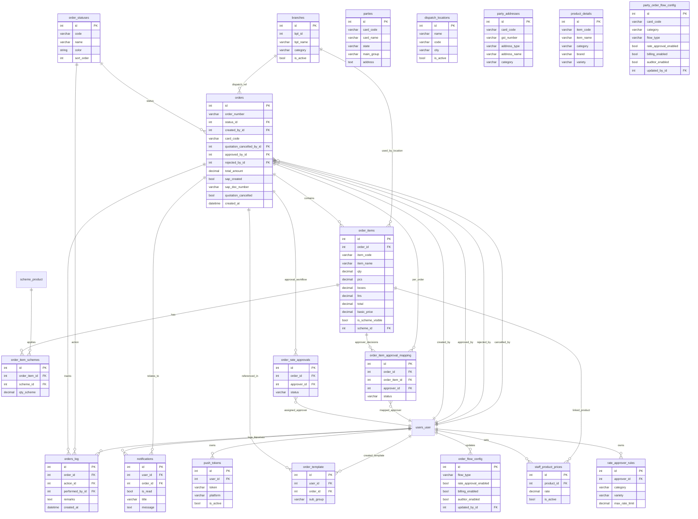
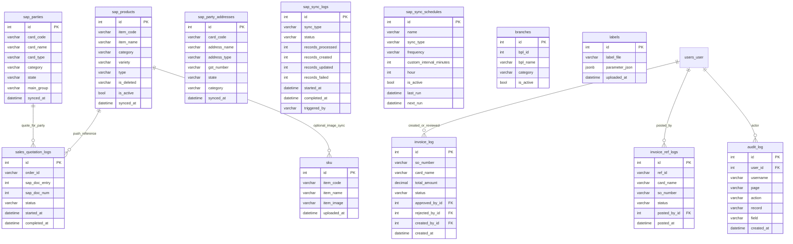

# DB Schema Diagrams (Mermaid)

This file documents the PostgreSQL schema used by OMS-Backend and the important runtime joins used across modules.

---

## 1) Core PostgreSQL ER diagram

```mermaid
erDiagram
    users_role {
        int id PK
        varchar name
        varchar display_name
        bool is_active
    }

    companies {
        int id PK
        varchar name
        bool is_active
    }

    main_groups {
        int id PK
        varchar name
        bool is_active
    }

    states {
        int id PK
        varchar name
        varchar code
        bool is_active
    }

    users_user {
        int id PK
        varchar username
        varchar name
        varchar phone
        int role_id FK
        int company_id FK
        int main_group_id FK
        int state_id FK
        int category_id FK
        bool is_superuser
        bool is_staff
        bool is_active
    }

    categories {
        int id PK
        varchar category
    }

    users_user_states {
        int id PK
        int user_id FK
        int state_id FK
    }

    scheme_product {
        int id PK
        varchar state_code
        int? category_id FK
        varchar item_code
        varchar scheme_name
        bool is_active
        bool is_scheme
    }

    party_product_assignments {
        int id PK
        int assigned_by_id FK
        varchar card_code
        varchar item_code
        varchar category
        decimal basic_rate
        bool is_active
        bool is_scheme
        int scheme_id FK
    }

    user_party_assignments {
        int id PK
        int user_id FK
        varchar card_code
        varchar category
        bool is_active
    }

    users_user ||--o{ users_user_states : has
    states ||--o{ users_user_states : links

    users_role ||--o{ users_user : has
    companies ||--o{ users_user : belongs_to
    main_groups ||--o{ users_user : belongs_to
    states ||--o{ users_user : primary_state
    categories ||--o{ users_user : category
    users_user ||--o{ users_user_states : user_states

    users_user ||--o{ users_user_states : assigned

    users_user ||--o{ user_party_assignments : assigned

    users_user ||--o{ party_product_assignments : assigns
    scheme_product ||--o{ party_product_assignments : optional_scheme
```

> Mermaid `erDiagram` does not support every join style; this is schema-level and does not cover all cross-module runtime links.

---

## 2) Orders domain (PostgreSQL)



> `product_details`, `parties`, `dispatch_locations`, and `party_addresses` are read through orders flows; they are not all directly FK-linked in the current model due legacy/import layout.

---

## 3) SAP Sync + legal/ invoice / SKU tables



> Note: `invoice_log` / `invoice_ref_logs` are lightweight operational logs, not part of the core order workflow.

---

## 4) Cross-module/runtime joins (important for onboarding)

The following are relationships used in code logic but **not strict Django FK constraints**:

- `orders.card_code` -> `sap_parties.card_code` and also many `sap_parties` rows can exist by `(card_code, category)`.
- `orders.card_name` -> `sap_parties.card_name` (normalization fallback when card code lookup is partial).
- `order_items.item_code` -> `sap_products.item_code`.
- `order_items.item_code` + `orders.order_type`/`card_code` -> `party_product_assignments` for pricing (rate check).
- `sales_quotation_logs.order_id` (string) -> `orders.id` (int) for response lookup.
- `party_product_assignments.card_code` + `item_code` -> `sku.item_code` for completed image check in `/api/sku/pending/`.
- `orders.status_id` + `party_order_flow_config` / `order_flow_config` decide approval pipeline behaviour at runtime.

---

## 5) Rendering tips (Mermaid)

- VS Code: enable Mermaid preview extension and open this file to visualize.
- Docs portals: GitHub markdown preview supports Mermaid if enabled in repo settings.
- If rendering fails, copy the diagram blocks into https://mermaid.live for quick visual validation.

---

## 6) Useful references

- [users-models.py](OMS-Backend/users/models.py)
- [orders-models.py](OMS-Backend/orders/models.py)
- [sap_sync/models.py](OMS-Backend/sap_sync/models.py)
- [invoice/models.py](OMS-Backend/invoice/models.py)
- [SKU/models.py](OMS-Backend/SKU/models.py)
- [legal/models.py](OMS-Backend/legal/models.py)
- [audit/models.py](OMS-Backend/audit/models.py)
